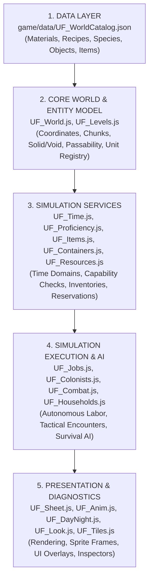

# ARCHITECTURE.md — Project DEUS Subsystem Ownership & Architecture

**Project Formal Name**: DEUS  
**Canonical Working Path**: `c:\Users\snewt\OneDrive\Desktop\UF`  
**Integration Authority**: Single designated integration authority for shared canonical commits.

---

## 1. Subsystem Ownership Matrix

Every concept in Project DEUS has exactly ONE authoritative subsystem owner:

| Subsystem | Authoritative Module(s) | Owned Responsibilities |
|---|---|---|
| **WORLD** | `UF_World.js` | XYZ coordinate space, terrain arrays, solid/void definitions, 256×256 area chunk loading, world mutation tracking, passability rules. |
| **WORLDGEN** | `UF_WorldGen.js`, `UF_Levels.js` | Procedural glade generation, climate, 5-level volumetric stratum, horizontal cave carving, natural resource placement. |
| **ENTITIES** | `UF_World.js` (registry), `UF_Colonists.js`, `UF_Wildlife.js` | Persistent creature registry, entity IDs, lifecycle state, biological age. |
| **TIME** | `UF_Time.js`, `UF_TimeSpeed.js` | Multi-domain clocks: Engine (20 Hz computation), Tactical Action (6s d20 round), Historical (1s = 2h aging), Presentation (60m solar cycle). Pause enforcement. |
| **CAPABILITIES** | `UF_Proficiency.js` | SRD 5.1 ability check engine, bounded proficiency ranks (Untrained to Grandmaster), capability resolution equation, work rate multiplier. |
| **JOBS** | `UF_Jobs.js` | Job creation, claim/assignment, continuous work accumulation, step execution, physical reservations, completion callbacks. |
| **INVENTORY** | `UF_Items.js`, `UF_Containers.js` | Physical item instances, creature finite slots (8) and weight limits, world container infrastructure, storage policies, container spill. |
| **RESOURCES** | `UF_Resources.js`, `game/data/UF_WorldCatalog.json` | Material physical properties registry, 8-tier physical resource resolution, material substitution matrix, harvest demands. |
| **CONSTRUCTION** | `UF_Construction.js`, `UF_Walls.js`, `UF_Floors.js`, `UF_Doors.js` | Multi-tile blueprint planning, 2-grid-high walls with black top-cap convention, door passage rules, structural room enclosure. |
| **PATHFINDING** | `UF_Movement8D.js`, `UF_NaturalConnections.js` | 8-directional movement, octile A* pathfinding, Z-transition stairs/caves, movement budgets. |
| **AI / PLANNING** | `UF_Colonists.js`, `UF_Households.js`, `UF_Goals.js` | Colonist survival needs, domestic household planning, autonomous settlement demands, emergent pairbonding, schedule cadences. |
| **COMBAT** | `UF_Combat.js`, `UF_DFCombat.js` | Tactical mode scheduler, d20 initiative, round budgets (Action, Bonus Action, Reaction, Movement), same-Z targeting, damage resolution. |
| **RENDERING** | `UF_Tiles.js`, `UF_Anim.js`, `UF_Perspective25D.js`, `UF_Fog.js`, `UF_DayNight.js` | Sprite animations (no code after-effects), 2.5D axonometric projection, dynamic depth sorting, fog of war, day/night screen tones. |
| **SAVE / LOAD** | `UF_Core.js`, RMMZ `DataManager` | Save schema versioning (`saveSchemaVersion`), explicit serialization, cache rebuilding upon load, data migrations. |
| **DIAGNOSTICS** | `UF_Sheet.js`, `UF_Look.js`, `UF_Test.js` | World/creature inspector, capability breakdown, cursor tooltips, test assertion harnesses. |

---

## 2. Dependency Direction & Hierarchy

Strict layered flow. Higher layers depend on lower layers; lower layers NEVER depend on higher layers.

### Invariant Rules:
1. **Presentation never defines simulation truth**: A closed UI window or hidden sprite cannot alter game rules or item counts.
2. **Simulation never polls UI**: AI routines query `UF.Resources` or `UF.Jobs`, never UI menus.
3. **No Circular Subsystem Ownership**: `UF_Items` does not call `UF_Jobs`; `UF_Jobs` calls `UF_Items`.

---

## 3. Foundational Invariants

1. **Spatial Invariant**: $1\text{ XY Grid Cell} = 5\text{ ft} \times 5\text{ ft}$; $1\text{ Z-Level} = 5\text{ vertical ft}$.
2. **Time Invariant**: $\text{World Tick (Computation)} \neq \text{Round (Tactical)} \neq \text{Year (Historical)} \neq \text{Sun (Presentation)}$.
3. **Physical Economy**: Resources exist physically in a creature, in a container, loose on ground, incorporated into a structure, or in unharvested nature. No abstract faction inventory.
4. **Finite Capacity**: Creatures have 8 inventory slots and physical mass limits ($60\text{ kg}$ standard). Containers have slot and weight capacities.
5. **Continuous Animation**: All motion comes from sprite sheets (Nano Banana Pro); zero code-driven after-effects or distortions.
6. **DF Black Wall-Top Convention**: 2-grid-high walls (48×96 px) display flat near-black (`#08080C` to `#121218`) on the upper 48 px cap.
7. **Same-Z Combat Invariant**: Standard attacks and tactical engagements require `sameZ(attacker, defender)`.
8. **Save Truth, Rebuild Cache**: Save only persistent mutable state; rebuild spatial registries, route caches, and resource indexes on load.

