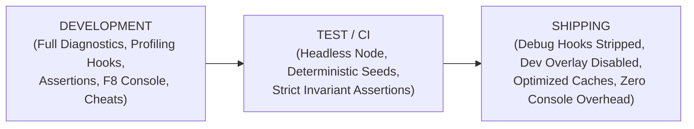

# DEUS — DEPENDENCY POLICY & ENVIRONMENT REGISTRY (v1)
**Authoritative Dependency Management Standard**
**Integration Authority:** Gemini / Antigravity
**Approved by Owner Directive:** 2026-09-25

---

## 1. Executive Summary
Project DEUS maintains a strictly controlled dependency footprint. To guarantee long-term determinism, reproducibility across machines, and zero runtime security vulnerabilities, every runtime library, editor dependency, and development tool is catalogued and version-locked.

---

## 2. Canonical Dependency Registry

### A. Core Runtime Engine & Container
| Dependency | Version | Role | Source / Location | License | Upgrade Policy |
|---|---|---|---|---|---|
| **RPG Maker MZ** | `v1.8.0+` | Core Engine & Map Editor | Official Distribution | Proprietary Commercial | Locked. Patch upgrades require full regression audit. |
| **NW.js** | `v0.84.0+` (Chromium 120+, Node 20+) | Desktop Runtime Container | `nw.exe` / `package.json` | MIT / BSD | Locked to stable LTS. Must support WebGL2 and modern JS. |
| **Node.js** | `v18.0.0+` (Recommended v20 LTS) | Headless Test & Tooling Runtime | System Path | MIT | Minimum supported version enforced in test harnesses. |

### B. Bundled Third-Party Engine Libraries (Frozen in `game/js/libs/`)
All libraries in `game/js/libs/` are read-only and frozen. No modifications permitted.

| Library | Bundled Version | Purpose | Upstream Authority | Modifiable? |
|---|---|---|---|---|
| **pixi.js** | `v5.3.12` (RMMZ bundled) | WebGL 2D Rendering Engine | PixiJS Team | NO (Read-only core) |
| **effekseer.js** | Bundled with RMMZ | Particle Effects Engine | Effekseer Team | NO (Read-only core) |
| **localforage.js** | `v1.9.0` | Cross-platform IndexedDB Storage | Mozilla / localForage | NO (Read-only core) |
| **pako.js** | Bundled with RMMZ | Deflate/Zlib Compression | pako Team | NO (Read-only core) |

### C. Node.js Tooling & Test Dependencies
DEUS test harnesses in `tools/` run natively on standard Node.js without requiring third-party npm packages wherever possible.
- **Built-in Node Modules Only:** `fs`, `path`, `v8`, `perf_hooks`, `child_process`, `crypto`.
- **Zero Runtime NPM Packages:** The shipping `game/` folder contains zero `node_modules` dependencies. All gameplay code consists of native ECMAScript 2022+ modules.

---

## 3. Environment Operating Profiles

The DEUS engine recognizes three distinct operating profiles:



1. **`DEVELOPMENT`:**
   - Active during editor playtest (F5) and local development.
   - Enables `UF_Sheet`, `UF_Look`, `L.stats()`, performance telemetry hooks, and detailed error logging.
2. **`TEST`:**
   - Active when test harnesses execute in headless Node.js or automated test snapshots.
   - Disables window/DOM dependencies; enforces strict deterministic seeds (`18`, `20260923`).
3. **`SHIPPING`:**
   - Active in release packages.
   - Disables developer hotkeys, developer overlay, debug console output, and stripped dev tools.

*Rule:* Environment configuration is governed centrally by `DEUS_Core.js`. Individual plugins must never invent competing ad-hoc environment flags.

---

## 4. Reproducible Environment Specification

To reproduce the canonical DEUS development and testing environment on any clean machine:

1. **System Requirements:** Windows 10/11 x64, 16+ GB RAM, NVMe SSD recommended.
2. **Runtimes:**
   - Install Node.js LTS (v20.x recommended): `node -v` $\ge$ 18.0.0.
   - Install RPG Maker MZ v1.8.0+ (for visual editor and assets).
3. **Repository Setup:**
   ```powershell
   git clone <repo_url> C:\Dev\DEUS
   cd C:\Dev\DEUS
   node tools\test_strata_cuts_and_caves.js --no-suites
   ```
4. **Validation:**
   - Running the base test suite must pass 100% of checks without errors or warnings.

---

## 5. Dependency Audit & Upgrade Policy

Before adding or upgrading any dependency:
1. **Justification:** Prove why the feature cannot be implemented cleanly with built-in Web / Node.js APIs.
2. **Footprint:** The dependency must not exceed 500 KB uncompressed.
3. **License:** Must be MIT, Apache-2.0, BSD-3-Clause, or CC-BY-4.0. No GPL/AGPL in runtime.
4. **Evaluation Window:** Run full regression suite and benchmark memory / boot times before merging.
