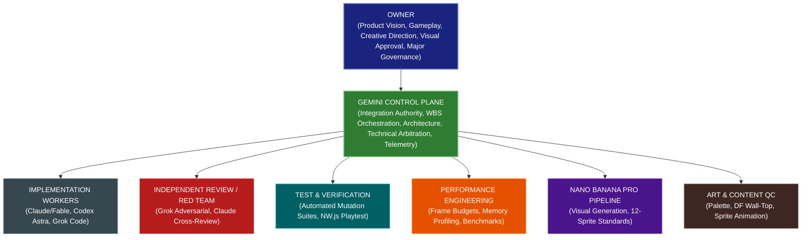
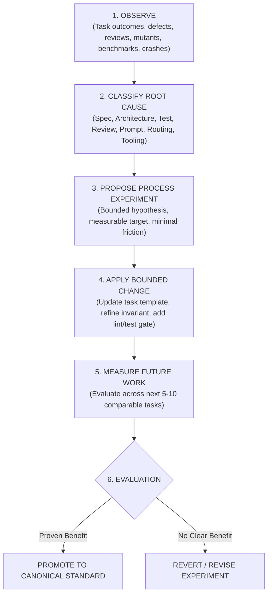
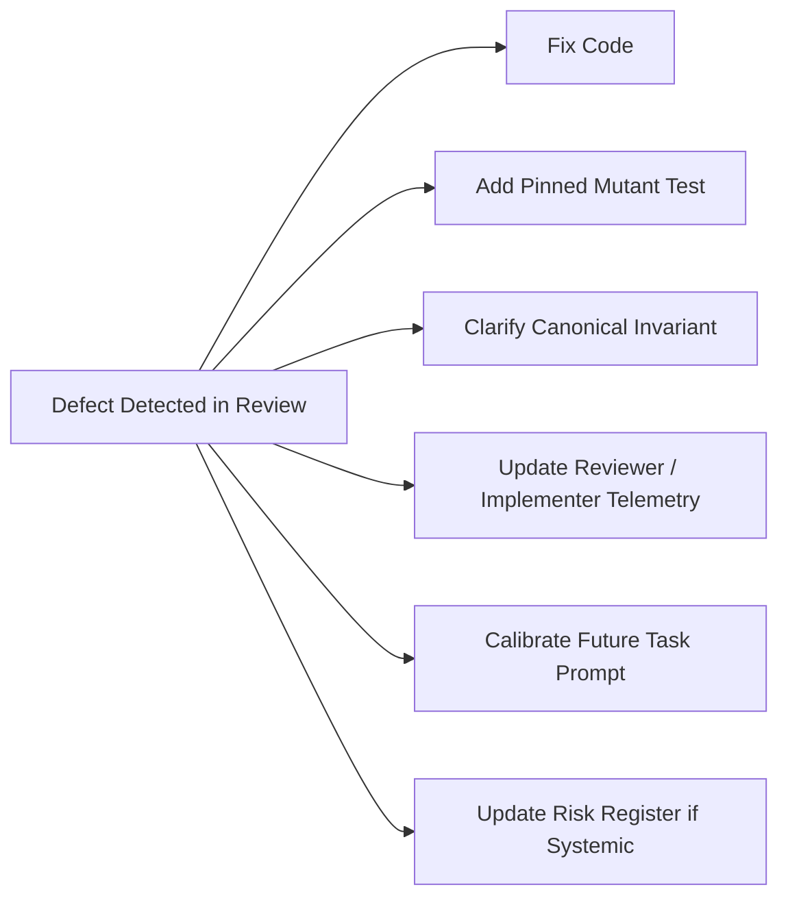

# DEUS — ORGANIZATIONAL OPERATING SYSTEM (v1)
**Self-Improving Engineering Organization Standard**
**Integration Authority:** Gemini / Antigravity
**Approved by Owner Directive:** 2026-09-25

---

## 1. Canonical North Star & Plain-Language Mental Model

### Canonical Principle
> *"DEUS is developed by a measurable, evidence-driven, continuously improving engineering organization. Work is not considered fully valuable merely because it completes a task. Significant outcomes must also improve the organization's ability to specify, route, implement, test, review, benchmark, integrate, recover, reproduce, and ship future work. Repeated classes of failure are treated as process defects. The organization converts useful evidence into durable improvements while avoiding unnecessary bureaucracy and metric gaming."*

### Primary Organizational Objectives
$$\text{Progress} = \text{Verified Accepted Delivery} + \text{Declining Failure Rate} + \text{Declining Owner Burden} + \text{Reproducible Shipping}$$

- **Verified Accepted Progress:** Milestones reached with concrete evidence.
- **Declining Repeated Failure:** Root causes eliminated across subsequent tasks.
- **Declining Owner Operational Burden:** The Owner directs vision and design, not mundane agent message courier work.
- **Improving Product Quality & Efficiency:** Higher fidelity simulation, tighter frame budgets, leaner token utilization.
- **Reproducible Shipping Capability:** Deterministic, one-command release packaging from canonical repository state.

### Plain-Language Mental Model: The Self-Improving Factory
Ordinary engineering executes a linear sequence:
$$\text{MAKE THING} \longrightarrow \text{TEST THING} \longrightarrow \text{SHIP THING}$$

DEUS operates as an adaptive system—a factory engineered to continuously improve its own machinery:
$$\begin{aligned}
\text{MAKE THING} &\longrightarrow \text{TEST THING} \longrightarrow \text{OBSERVE OUTCOMES \& DEFECTS} \\
&\longrightarrow \text{IMPROVE GENERATION / SPECIFICATION / PROCESS} \\
&\longrightarrow \text{VERIFY PROCESS IMPROVEMENT} \longrightarrow \text{APPLY IMPROVEMENT TO NEXT TASK}
\end{aligned}$$

Every substantive project event yields up to two valuable outputs:
1. **Product Change:** Code, terrain, art, mechanics, or performance optimizations committed to the project.
2. **Process Improvement:** Clarified invariants, tighter prompt templates, targeted mutation suites, durable runbooks, or calibrated routing profiles.

*Rule:* Process improvements are created only when a genuine, reusable lesson exists. No synthetic bureaucracy or process manufacturing.

---

## 2. Organizational Hierarchy & Authority

### Authority Invariants
1. **Owner Authority:** Retains sole approval over game vision, player experience, visual art acceptance, lore/factions, and major scope/governance trade-offs.
2. **Gemini Integration Authority:** Gemini is the single authoritative coordinator. Only Gemini integrates candidate branches into canonical `main`.
3. **Single Active Writer:** Exactly one primary writer owns a given file set or task worktree at any time. No concurrent uncoordinated edits.
4. **Independent Review:** Reviewers form verdicts independently before reading author explanations or rebuttals.
5. **No Owner Messenger Work:** Agents communicate via structured mailboxes ([`docs/AGENT_COMMUNICATION_PROTOCOL.md`](file:///c:/Users/snewt/OneDrive/Desktop/UF/docs/AGENT_COMMUNICATION_PROTOCOL.md)). The Owner never acts as an operational message courier.

---

## 3. Policy Precedence & Conflict Resolution

When statements, prompt instructions, or conventions appear to conflict, apply strict priority order:

1. **Owner Directive** (Direct, explicit instruction from Owner)
2. **Canonical Vision & WBS** ([`docs/VISION.md`](file:///c:/Users/snewt/OneDrive/Desktop/UF/docs/VISION.md), [`docs/worldgen/DEUS_WORLDGEN_WBS.md`](file:///c:/Users/snewt/OneDrive/Desktop/UF/docs/worldgen/DEUS_WORLDGEN_WBS.md))
3. **DEUS Organizational Operating System** (This document)
4. **Domain Architecture & Policies** ([`docs/INVARIANT_REGISTRY.md`](file:///c:/Users/snewt/OneDrive/Desktop/UF/docs/INVARIANT_REGISTRY.md), [`docs/PERFORMANCE_ARCHITECTURE.md`](file:///c:/Users/snewt/OneDrive/Desktop/UF/docs/PERFORMANCE_ARCHITECTURE.md), [`docs/QUALITY_ENGINEERING_POLICY.md`](file:///c:/Users/snewt/OneDrive/Desktop/UF/docs/QUALITY_ENGINEERING_POLICY.md), [`docs/AGENT_UTILIZATION_POLICY.md`](file:///c:/Users/snewt/OneDrive/Desktop/UF/docs/AGENT_UTILIZATION_POLICY.md))
5. **Active Task Contract / Handoff** (Task-specific contract file in worktree)
6. **Worker Implementation Notes** (Scratchpads, internal thinking, conversation history)

*Conflict Rule:* Gemini explicitly notes policy conflicts upon detection. Routine domain conflicts are resolved via this hierarchy. Only conflicts impacting product vision, major architecture, or scope are escalated to the Owner.

---

## 4. Subsystem Integration & Explicit Functions

The DEUS Organizational Operating System coordinates eighteen core engineering functions across dedicated subsystems:

| Function | Domain Authority / Policy Document | Primary Responsibility |
|---|---|---|
| **Product** | [`docs/VISION.md`](file:///c:/Users/snewt/OneDrive/Desktop/UF/docs/VISION.md) | Game charter, fantasy simulation scope, WBS milestone priorities |
| **Architecture** | [`docs/ARCHITECTURE.md`](file:///c:/Users/snewt/OneDrive/Desktop/UF/docs/ARCHITECTURE.md), [`docs/INVARIANT_REGISTRY.md`](file:///c:/Users/snewt/OneDrive/Desktop/UF/docs/INVARIANT_REGISTRY.md) | Subsystem boundaries, 5-strata micro-Z, Year-0 worldgen, single truth |
| **Implementation** | Worktree branches (`task/*`) | Bounded code production, feature increments, bug fixes |
| **Quality Engineering** | [`docs/QUALITY_ENGINEERING_POLICY.md`](file:///c:/Users/snewt/OneDrive/Desktop/UF/docs/QUALITY_ENGINEERING_POLICY.md) | Unit tests, 100% mutant detection, adversarial review, native NW.js proof |
| **Performance Engineering** | [`docs/PERFORMANCE_ARCHITECTURE.md`](file:///c:/Users/snewt/OneDrive/Desktop/UF/docs/PERFORMANCE_ARCHITECTURE.md) | 60 FPS budgets, zero global scans per frame, memory ceilings, benchmarks |
| **Release Engineering** | [`docs/RELEASE_ENGINEERING.md`](file:///c:/Users/snewt/OneDrive/Desktop/UF/docs/RELEASE_ENGINEERING.md) | Deterministic packaging, manifest validation, DEV_ONLY asset stripping |
| **Configuration Management** | [`docs/DEPENDENCY_POLICY.md`](file:///c:/Users/snewt/OneDrive/Desktop/UF/docs/DEPENDENCY_POLICY.md) | Environment profiles (DEVELOPMENT, TEST, SHIPPING), runtime toggles |
| **Dependency Management** | [`docs/DEPENDENCY_POLICY.md`](file:///c:/Users/snewt/OneDrive/Desktop/UF/docs/DEPENDENCY_POLICY.md) | RMMZ, NW.js, Node.js version locking, zero mystery packages |
| **Data / Schema Governance** | [`docs/SCHEMA_AND_COMPATIBILITY.md`](file:///c:/Users/snewt/OneDrive/Desktop/UF/docs/SCHEMA_AND_COMPATIBILITY.md) | `saveSchemaVersion`, non-destructive migrations, cache rebuild on load |
| **Security / Secrets** | [`docs/SECURITY_AND_SECRETS.md`](file:///c:/Users/snewt/OneDrive/Desktop/UF/docs/SECURITY_AND_SECRETS.md) | Zero API keys/tokens in repo, least-privilege agent CLI execution |
| **Backup / Recovery** | [`docs/BACKUP_AND_RECOVERY.md`](file:///c:/Users/snewt/OneDrive/Desktop/UF/docs/BACKUP_AND_RECOVERY.md) | NVMe active repo, crash-resilient worktrees, periodic external archives |
| **Observability** | [`docs/OBSERVABILITY.md`](file:///c:/Users/snewt/OneDrive/Desktop/UF/docs/OBSERVABILITY.md) | Runtime inspection (`UF_Sheet`, `UF_Look`, `L.stats()`), debug state logging |
| **Issue / Bug Tracking** | `docs/issues/` (Consolidation) | Durable tracking of bugs found outside active task review |
| **Asset Management** | `docs/ASSET_MANIFEST.md`, `game/data/UF_WorldCatalog.json` | Semantic cataloguing, atlas packing, permanent slot coordinates |
| **Provenance / Licensing** | [`docs/ART_STANDARD.md`](file:///c:/Users/snewt/OneDrive/Desktop/UF/docs/ART_STANDARD.md), [`docs/SRD_CATALOGUE_CROSSWALK.md`](file:///c:/Users/snewt/OneDrive/Desktop/UF/docs/SRD_CATALOGUE_CROSSWALK.md) | D&D SRD 5.1 CC-BY-4.0 attribution, original Nano Banana Pro assets, U7 stand-ins |
| **Accessibility / Localization** | Architecture standard (Consolidation) | Externalized string keys, remappable inputs, non-color-only UI cues |
| **Documentation** | `docs/`, `AGENTS.md` | Single canonical documentation set, zero parallel obsolete tracking |
| **Continuous Learning** | [`docs/AGENT_QUALITY_LEARNING_LOOP.md`](file:///c:/Users/snewt/OneDrive/Desktop/UF/docs/AGENT_QUALITY_LEARNING_LOOP.md) | Outcome telemetry, reviewer scoring, prompt iteration, process experiments |

---

## 5. Single Organizational State & End-to-End Traceability

Every substantive engineering effort traces cleanly through a single lifecycle chain:

$$\begin{aligned}
\text{WBS Requirement} &\longrightarrow \text{Task Contract} \longrightarrow \text{Assigned Worker} \longrightarrow \text{Isolated Worktree} \\
&\longrightarrow \text{Implementation} \longrightarrow \text{Mutation \& Regression Suite} \longrightarrow \text{Adversarial Review} \\
&\longrightarrow \text{Defect Remediation} \longrightarrow \text{Performance Benchmark} \longrightarrow \text{Native NW.js Proof} \\
&\longrightarrow \text{Gemini Canonical Integration} \longrightarrow \text{Outcome Telemetry} \longrightarrow \text{Continuous Learning}
\end{aligned}$$

At any point, the organization can definitively answer:
- **What are we building?** (Exact WBS node and acceptance criteria).
- **Who owns it?** (Explicit agent assignment and worktree path).
- **Why are we building it?** (Gameplay mechanic, architectural invariant, or performance budget).
- **What proves it works?** (Automated tests, surviving mutants = 0, golden seed hash match, screenshot).
- **How expensive is it?** (Benchmark ms delta, memory allocation delta, save file character growth).
- **What did we learn?** (Telemetry entry in `docs/telemetry/`, process adjustments).

---

## 6. The DEUS Organizational Learning Loop (Meta-Learning)

The organization executes a structured feedback loop that improves its own processes:

### Root Cause Classification Categories
When a defect, regression, or failure occurs, categorize its primary driver:
- `SPECIFICATION`: Underspecified boundaries, ambiguous edge cases, missing fixture specs.
- `ARCHITECTURE`: Violation of subsystem ownership, double-accounting, invalid data model.
- `IMPLEMENTATION`: Logic flaw, bounds error, off-by-one, typing assumption.
- `TEST`: Test unable to fail, tautological assertion, synthetic fixture missing real rules.
- `REVIEW`: Review missed real defect, or reviewer generated false-positive hallucination.
- `PERFORMANCE`: Global scan introduced, unculled sprite allocations, unthrottled ticking.
- `ROUTING`: Suboptimal model assigned for task complexity tier.
- `PROMPT`: Overly verbose context, missing negative constraints, ambiguous instructions.
- `COMMUNICATION`: Dropped handoff, missing mailbox state, messenger relay failure.
- `OWNERSHIP`: Concurrent edits, missing file boundary locks.
- `DEPENDENCY`: Environment mismatch, node version incompatibility.
- `CONFIGURATION`: Misplaced environment flag, development code leaking into production.
- `BUILD_RELEASE`: Missing asset in package, packaging path error.
- `SAVE_SCHEMA`: Unversioned state mutation, broken migration.
- `SECURITY`: Credential in log, improper file access.
- `RECOVERY`: Lost worktree state, non-reproducible crash.
- `ART_QC`: Failed palette check, non-sprite code animation, broken wall-top convention.
- `CONTENT_QC`: Unresolved catalogue ID, missing recipe input.
- `OWNER_AMBIGUITY`: Unclear product vision requiring Owner arbitration.
- `OTHER`: Unforeseen environmental anomaly.

---

## 7. Cross-System Improvement Triggers (Synergy)

A single failure or observation should strengthen multiple defensive layers:

- **Defect Caught in Review:** Fix implementation $\rightarrow$ add pinned mutant test $\rightarrow$ update reviewer & implementer telemetry $\rightarrow$ clarify invariant $\rightarrow$ adjust future task prompt.
- **Escaped Defect (Found Late / in Playtest):** Fix defect $\rightarrow$ audit missed gate $\rightarrow$ enhance test harness $\rightarrow$ update [`docs/RISK_REGISTER.md`](file:///c:/Users/snewt/OneDrive/Desktop/UF/docs/RISK_REGISTER.md) if architectural.
- **Performance Regression:** Profile call stack $\rightarrow$ apply algorithmic fix $\rightarrow$ record baseline in [`docs/PERFORMANCE_ARCHITECTURE.md`](file:///c:/Users/snewt/OneDrive/Desktop/UF/docs/PERFORMANCE_ARCHITECTURE.md) $\rightarrow$ add automated threshold gate.
- **Agent Crash / Broken Session:** Recover worktree $\rightarrow$ verify durable mailbox state $\rightarrow$ update operational runbook in [`docs/BACKUP_AND_RECOVERY.md`](file:///c:/Users/snewt/OneDrive/Desktop/UF/docs/BACKUP_AND_RECOVERY.md).
- **Repeated Owner Question:** Agents unable to resolve internally $\rightarrow$ update spec, authority table, or invariant registry $\rightarrow$ eliminate future ambiguity.
- **Rejected Art Asset:** Log defect in asset telemetry $\rightarrow$ refine Nano Banana Pro prompt template $\rightarrow$ enforce palette / black wall-top pre-check tool.
- **Save / Load Mismatch:** Fix serialization $\rightarrow$ add schema migration test to [`docs/SCHEMA_AND_COMPATIBILITY.md`](file:///c:/Users/snewt/OneDrive/Desktop/UF/docs/SCHEMA_AND_COMPATIBILITY.md).

---

## 8. Preventing Process Bloat, Process Debt & The Anti-Goodhart Rule

### The Anti-Bloat Gate
Before introducing any new process requirement, template section, or operational gate, ask:
1. *What specific, repeated, or critical risk does this prevent?*
2. *What concrete evidence triggered it?*
3. *Can an existing mechanism or test catch it instead?*
4. *What maintenance and token cost does it create?*
5. *Can it be fully automated via a script rather than human/agent memory?*
6. *How will we measure whether it succeeded?*

If no clear answers exist: **Do NOT add the process.**

### Process Debt Management
Process debt is tracked separately from code debt:
- **Code Debt:** Unoptimized algorithms, legacy shims, messy variable scoping.
- **Process Debt:** Manual owner prompt relays, duplicate trackers, giant redundant prompts, undocumented manual build steps.
*Resolution:* Meaningful process debt is logged and addressed systematically during scheduled consolidation windows.

### Anti-Goodhart Invariant
> *"No single DEUS organizational metric becomes a target in isolation."*
- Do not reward reviewers solely on finding count (prevents false positives).
- Do not reward implementers solely on first-pass rate (prevents excessive risk aversion).
- Do not measure Gemini solely on owner-interruption count (prevents concealing decisions requiring Owner vision).
*Rule:* Metrics inform holistic technical judgment; they never replace it.

---

## 9. Learning Cadence & Knowledge Lifecycle

### Learning Cadence
- **After Every Substantive Task:** Record structured task outcome in telemetry (`docs/telemetry/`).
- **After Repeated Failures (2+ occurrences):** Perform targeted root-cause analysis and apply bounded process correction.
- **After ~10 Comparable Tasks:** Review agent routing, model tier performance, prompt effectiveness, and benchmark drift.
- **At Major WBS Milestones:** Conduct holistic organizational health review.
- **At Release Candidates:** Execute formal release readiness audit.

### Knowledge Promotion & Retirement
Organizational knowledge moves through a formal promotion pipeline:
$$\text{Observation} \longrightarrow \text{Validated Lesson} \longrightarrow \text{Candidate Invariant} \longrightarrow \text{Canonical Standard}$$

When rules become obsolete due to engine evolution:
- Mark rule as `SUPERSEDED`, `DEPRECATED`, or `RETIRED`.
- Cite replacing standard and date.
- Remove obsolete instructions from active worker prompts to prevent context pollution.

---

## 10. Owner Interface Standard

Owner reports must be delivered in clear, readable plain English, answering five core questions:
1. **What happened?** (Concrete summary of accomplished work and test results).
2. **What does that term mean?** (Plain-language explanation of technical terms).
3. **Why does it matter?** (Direct impact on gameplay, simulation stability, or performance).
4. **What are the agents doing next?** (The immediate next milestone or task in flight).
5. **Does the Owner need to decide anything?** (Clear, explicit decision items, or confirmation of autonomous continuation).

*Standard:* Do not dump raw internal logs or unparsed telemetry on the Owner unless specifically requested. Present synthesized, verified truth.
