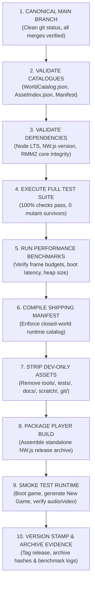

# DEUS — RELEASE ENGINEERING & BUILD STANDARD (v1)
**Authoritative Packaging & Release Specification**
**Integration Authority:** Gemini / Antigravity
**Approved by Owner Directive:** 2026-09-25

---

## 1. Executive Summary
DEUS release engineering guarantees that every player build is completely reproducible, deterministically verifiable, lean, and free of extraneous development or testing artifacts. Releases are assembled through a single controlled command, never via manual ad-hoc file copying.

---

## 2. Reproducible Build Pipeline

---

## 3. Closed-World Shipping Validation

The release packaging pipeline enforces a strict closed-world policy:

> *"Every file present in the packaged player build must have an authoritative entry in the shipping manifest. Any uncatalogued, extraneous, or development-only file aborts the release build immediately."*

### Excluded / Stripped Artifacts
The following directories and patterns are strictly purged from shipping builds:
- `tools/` (Test harnesses, mutation suites, art generators, benchmarks)
- `docs/` (Specifications, WBS, logs, transcripts, prompts)
- `reference/` (Style references, training data, stand-in sources)
- `scratch/` (Temporary scratchpads, pre-migration dumps)
- `.git/`, `.gitignore`, `.gitattributes`
- Development shims marked `NEEDS_MIGRATION` or `DEV_ONLY`
- Uncompressed source art assets (`.psd`, `.kra`, `.raw`)

---

## 4. Release Readiness Definition

A build candidate is declared **RELEASE READY** only when all of the following conditions are met with concrete, inspected evidence:

1. **Automated Correctness:** 100% of automated tests pass; zero failures.
2. **Deterministic Worldgen:** Seed `18` and `20260923` produce bit-identical checksums across fresh processes.
3. **Performance Compliance:**
   - Boot time to title screen $\le 2.0\text{ s}$.
   - New Game world generation (Seed 18) $\le 12.0\text{ s}$.
   - Map rendering achieves steady 60 FPS under `PERF_QUIET_WORLD` and $\ge 50\text{ FPS}$ under `PERF_HEAVY_FLUID`.
4. **Zero Console Errors:** Zero unhandled exceptions or error messages in the NW.js runtime console during a 5-minute automated playtest smoke run.
5. **Asset Integrity:** Zero missing textures, zero placeholder boxes, zero unregistered audio cues.
6. **Save Compatibility:** Clean load from previous minor-version save file, or explicit migration triggered successfully.
7. **Owner Gate Approval:** Owner provides explicit visual and release approval.

---

## 5. Version Stamping & Artifact Archival

When a release is finalized:
- The build is tagged with semantic versioning (`v0.1.0-alpha`, etc.).
- Release manifest, sha256 checksums of packaged executables, and benchmark logs are archived under `releases/evidence/<version>/`.
