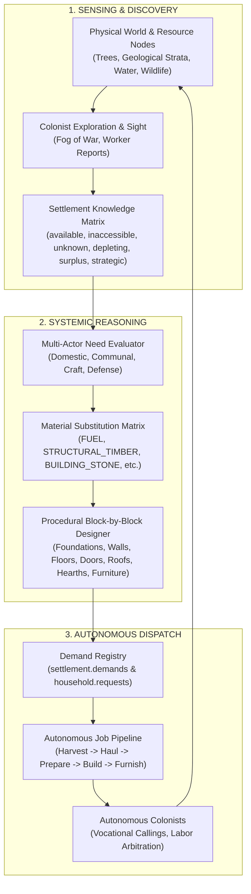

# AUTONOMOUS_CIVILIZATION.md — Architecture of Zero-Player Simulation

Project formal name: **DEUS**  
Binding Authority: `docs/VISION.md` (V125)  
Date: 2026-09-21  

---

## 1. Core Principle: The World Must Not Require The Player

Project DEUS is not fundamentally a colony-management game where the player issues the orders necessary for civilization to function.

**The player is God.**
- God may observe.
- God may intervene.
- God may alter history.
- God may do absolutely nothing.

**The world must continue regardless.**

Therefore, the complete material, gathering, construction, industry, profession, settlement, and technological progression system must be capable of operating autonomously with **ZERO PLAYER INPUT**.

### World Start Baseline
- 8 human founders (4 male / 4 female).
- One campfire in the habitable wilderness.
- No prebuilt settlement or stockpiles.
- Primitive starting capabilities.

If the player never issues a command after world creation, those people must still be capable of attempting to survive, harvesting resources, designing structures block-by-block, building workshops, reproducing, and establishing a civilization.

A colony may fail due to famine, disease, predators, environmental hostility, or social collapse—but a colony must **never** fail simply because the player did not issue a command.

---

## 2. The Nine Architectural Pillars



---

## 3. Pillar Breakdown & Data Model

### Pillar 1: Materials Create Autonomous Opportunities
Colonists evaluate local material abundance and physical properties to adapt their survival strategy:
- Softwood abundance (Pine, Willow) $\rightarrow$ rapid timber construction of initial shelters.
- Hardwood stands (Oak, Ash) $\rightarrow$ durable structural beams, furniture, defensive gates.
- Dense stone outcrops (Granite, Basalt) $\rightarrow$ deferred until bronze/iron tools exist; local soft stone (Sandstone, Limestone) quarried first.
- Metal scarcity (absence of copper/tin or iron) $\rightarrow$ expansion of stone/bone toolcraft, exploration, trade, and deeper Z-level mining.

### Pillar 2: Autonomous Resource Assessment (Non-Omniscient)
Settlement knowledge is tracked in `settlement.knowledge` and updated through physical colonist observation:

```javascript
settlement.knowledge = {
    availableNow: {
        // Items in stockpiles, carried in inventories, or on accessible ground
        // Format: { [itemIdOrTag]: { totalCount, locations: [{ area, x, y }] } }
    },
    knownInaccessible: {
        // Discovered resource nodes that cannot currently be worked (e.g. granite without metal pick)
        // Format: [{ type, mat, area, x, y, reason: "needs_tool" }]
    },
    unknown: {
        // Terrain cells outside explored fog-of-war and unvisited Z-levels
    },
    depleting: {
        // Stocks declining faster than consumption safety thresholds (e.g. firewood, winter rations)
        // Format: { [tag]: { current, consumptionRate, daysRemaining } }
    },
    surplus: {
        // Stocks exceeding operational buffer limits (candidates for trade or storage)
    },
    strategic: {
        // Rare materials reserved for high-value items (Yew for warbows, Marble for altars, Steel for swords)
    }
};
```

### Pillar 3: Material Demand Must Generate Jobs
Physical and social needs create demands, which dispatch jobs automatically:
1. **Need:** Household lacks shelter before nightfall / cold.
2. **Demand:** 12 `STRUCTURAL_TIMBER`, 4 `BUILDING_STONE`, 1 `DOOR`.
3. **Inventory Check:** Settlement holds 4 timber, 0 stone.
4. **Job Generation:**
   - Woodcutter job: fell nearest pine trees $\rightarrow$ produce 8 logs.
   - Hauler job: haul logs directly to unbuilt construction site.
   - Quarry job: harvest loose limestone boulders $\rightarrow$ produce 4 stone blocks.
   - Builder job: erect foundations, walls, door, hearth, and roof deck.

### Pillar 4: Autonomous Block-by-Block Building Design
No fixed Warcraft-style prefabs. The blueprint generator dynamically composes structures:
- **Foundations:** Perimeter footprint matching household or communal size.
- **Walls:** Perimeter wall segments leaving a 1-tile door opening on the south or accessible face.
- **Door:** Swing door object with faction permissions.
- **Flooring:** Dressed planks, flagstones, or rushes laid across interior ground cells.
- **Roof:** Overhead roof deck on Z+1 providing full interior weather shelter.
- **Hearths & Furniture:** Fireplace placed on north wall, beds positioned against lateral walls, storage chests near the door.
- **Adjoining Expansion:** Generational expansions abut existing family dwellings with shared party walls.

### Pillar 5: Building Design Must Respond to Materials
Blueprints specify functional material roles rather than rigid catalog IDs:
- A wall requests `STRUCTURAL_TIMBER`; AI selects abundant Pine over scarce Oak.
- AI strictly avoids consuming strategically valuable materials (`strategic` list: Yew, Marble, Steel) for low-value construction unless explicitly authorized.
- Emergent vernacular architecture reflects local biomes:
  - Boreal forest: Pine-log chalets with steep cedar-shake roofs.
  - Highland scrub: Limestone drystone cabins with slate-shingle roofs.
  - Arid basin: Sandstone flat-roof compounds with mud-brick floors.

### Pillar 6: General Material Substitution Matrix
Functional property tags define recipe and construction compatibility:
- `FUEL`: Firewood, Charcoal, Peat, Coal
- `STRUCTURAL_TIMBER`: Pine, Oak, Ash, Birch, Elm
- `FLEXIBLE_BOW_WOOD`: Yew, Ash, Elm
- `HARD_WOOD`: Oak, Yew, Ash
- `BUILDING_STONE`: Limestone, Sandstone, Granite, Basalt, Slate, Marble
- `ROOFING_MATERIAL`: Slate, Thatch/Fiber, Wood Shakes
- `CUTTING_METAL`: Bronze, Iron, Steel, Copper
- `CORDAGE`: Fiber, Sinew, Leather Thongs
- `TEXTILE_FIBER`: Flax, Wool, Straw Fiber
- `LEATHER`: Cured Leather, Raw Hides
- `INSULATING_MATERIAL`: Fur, Wool, Down Feathers, Straw

### Pillar 7: Households as Economic Agents
Domestic units autonomously identify private needs:
- Unhoused founders or newly wedded couples $\rightarrow$ construct private homestead.
- Growing children / teens $\rightarrow$ expand dwelling with adjoining bedroom annex.
- Winter approaching without indoor heat $\rightarrow$ build stone hearth and chimney.
- Artisan calling discovered $\rightarrow$ construct street-facing workshop counter.

### Pillar 8: Autonomous Settlement-Level Construction
Communal projects are triggered by simulated aggregate conditions:
- **Larder / Storehouse:** Harvested raw food exceeding 20 units and risking spoil.
- **Cistern / Well:** Settlement center $> 25$ tiles from freshwater source.
- **Great Hall:** Population $> 12$ requiring communal dining, council meetings, and temporary lodging.
- **Bloomery / Forge:** Ore deposits surveyed and charcoal reserves $> 10$.
- **Town Square & Market:** Traveling caravans arriving along edge roads.
- **Defensive Palisades:** Predator attacks or hostile faction scouts detected within territory.

### Pillar 9: Multi-Actor Project Generation
Projects originate from four distinct societal bodies:
1. **Domestic Households:** Private living quarters, clan compounds, family hearths, private beds.
2. **Settlement Council:** Storehouses, town halls, wells, roads, palisades, communal granaries.
3. **Specialist Guilds / Workshops:** Blacksmith forges, carpentry sawpits, masonry yards, tannery racks.
4. **Defense / Militia:** Guard towers, armory weapon racks, fortified gatehouses.

---

## 4. Verification Standard

Every milestone must prove zero-player autonomy:
- A test simulation starting from raw world creation (8 founders, one campfire, wilderness) must be capable of running unprompted for $\ge 15$ minutes at $32\times$ speed.
- The test asserts that without a single player click or designation:
  1. Colonists assess local wood and stone.
  2. Homes are designed and constructed block-by-block.
  3. Private couples move into sheltered rooms and conceive children.
  4. Specialized workshops and callings emerge.
  5. The settlement expands into a multi-generation community.
