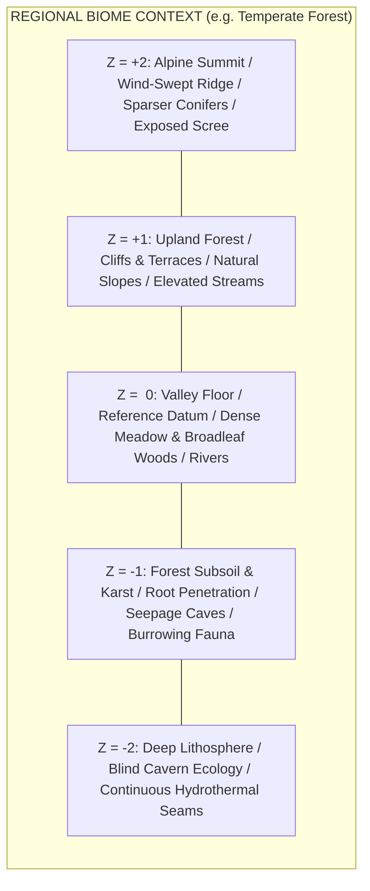
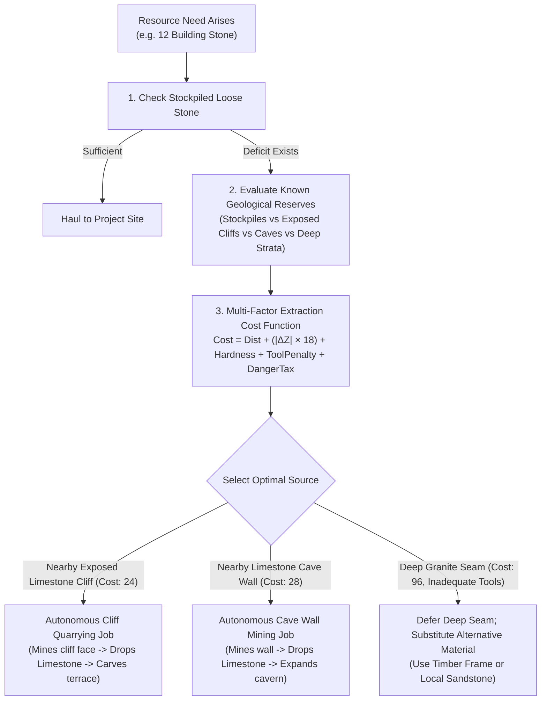

# VERTICAL_NATURAL_WORLD.md — Architecture of Continuous Natural Verticality

Project formal name: **DEUS**  
Binding Authority: `docs/VISION.md` (V125, V126, V127)  
Date: 2026-09-21  

---

## 1. Core Principle: Nature Forms Vertically

Project DEUS does not treat Z0, Z-1, Z-2, Z+1, and Z+2 as independent, disconnected stacked 2D maps with separately rolled biomes. 

**Nature forms vertically.**



### 1.1 The Reference Datum Rule
- **Z0 is the reference elevation datum**, NOT synonymous with "the surface".
- Natural terrain may rise naturally to Z+1 and Z+2, and carve naturally down into Z-1 and Z-2.
- A single horizontal $(x, y)$ coordinate can naturally contain:
  - Valley floor at Z0.
  - Cliff face rising from Z0 to Z+1.
  - Walkable plateau surface at Z+1.
  - Stepped slope or escarpment rising to Z+2.
  - Mountain woodland growing on Z+2.
  - Cave portal penetrating horizontally into the Z0 or Z+1 cliff.
  - Cavern system descending into Z-1 or Z-2 directly beneath that forested plateau.

### 1.2 Unified Vertical Coordinate Space
- **Positive Z levels (+1, +2)** are active participants in **NATURAL WORLDGEN**, not empty voids reserved solely for player-constructed second storeys and roofs.
- **Negative Z levels (-1, -2)** are subterranean portions of the **SAME CONTINUOUS TERRAIN VOLUME**, whose geometry, fractures, hydrology, and mineral veins correlate directly with the surface above them.
- **Natural and Constructed Verticality share a single unified coordinate space**: a colonist can walk up a natural ramp onto a Z+1 plateau, construct a stone cabin on it, and erect a wooden second floor at Z+2 using the exact same coordinates and mechanics.

---

## 2. Foundational Laws: Biome vs. Geology & Rock as Geometry

### 2.1 Biomes Exist Across Z-Levels
A biome is NOT a 2D tile stamp applied independently per Z-level. A biome is a regional ecological/environmental system that extends vertically throughout the world column:
$$\text{Regional Biome} + \text{Local Elevation} + \text{Geology} + \text{Depth} + \text{Light} + \text{Moisture} = \text{Local Ecological Expression}$$

- **Temperate Forest Region**:
  - **Z+2 (Ridge/Summit)**: Sparser wind-stunted pine/oak, exposed rock faces, thin soil, alpine shrubs.
  - **Z+1 (Upland/Terrace)**: Mixed woodland, berry shrubs, cliff faces, elevated streams.
  - **Z0 (Valley/Lowland)**: Dense broadleaf forest (Oak, Ash), lush meadows, rivers, diverse wildlife.
  - **Z-1 (Forest Karst/Shallow Caves)**: Tree roots penetrating ceiling, rich soil/subsoil, groundwater seepage, moss, fungi, bats, rodents.
  - **Z-2 (Deep Caverns)**: Subterranean water courses, mineral formations, specialized lightless fungi, troglobite organisms.

### 2.2 Biome and Geology are Related but Distinct Concepts
- **Biome** answers: Climate, rainfall, temperature, sunlight, vegetation, wildlife, ecological productivity.
- **Geology** answers: Rock types (strata), mineral veins, cave morphology, fracture mechanics, excavation difficulty, building material properties.
- **Emergent Divergence**: Two regions with the identical "Temperate Forest" surface biome may rest on radically different geology:
  - *Forest on Limestone*: Rich solution caves, underground sinkholes, easily quarried soft building stone, quicklime production.
  - *Forest on Granite*: Monolithic crags, sheer cliff faces, fault-fracture caves, dense durable stone requiring metal picks, heavy fortification capability.

### 2.3 All Natural Rock is Material: The World Geometry IS the Resource
- Do NOT restrict stone gathering to arbitrary decorative "stone resource nodes" (`rocks_small`, `granite_boulder`).
- **Every solid rock cell in the world volume is a mineable physical resource**:
  - Exposed cliff faces on Z0, Z+1, and Z+2.
  - Cave walls on Z0, Z-1, and Z-2.
  - Cave floors (for downward shaft channeling).
  - Cave ceilings (for upward excavation where structurally supported).
  - Mountain crags and rock pillars.
- **Mining is Space Creation + Resource Extraction**:
  $$\text{SOLID ROCK} \xrightarrow{\text{Excavation Work}} \text{Stone Yield} + \text{FLOOR / VOID (Newly Traversable Space)}$$
  - Mining a cliff face or cave wall removes the `SOLID` shape, installs a walkable `FLOOR` (or `OPEN` air), updates pathfinding and LOS, and drops stone matching the exact geological stratum of that cell.
- **Natural Caves and Artificial Mines Share the Same Representation**: Both are simply voids within solid geological material. A natural cave generated at worldgen seamlessly expands into an artificial mine as colonists quarry into its walls.
- **Ore-Bearing Rock is Still Rock**: Mineralization occurs *within* rock. Mining a copper vein in limestone yields both limestone building chunks and copper-bearing ore.

---

## 3. Audit of Existing DEUS Z Implementation

| Subsystem | Existing State in Codebase | What is Missing for Natural Verticality | Extensibility Assessment |
|---|---|---|---|
| **Coordinate Framework** (`UF_World.js`) | `CellRef = { area: {x,y}, x, y, z: -2..2 }`. Full 5-level spatial addressing exists. | Currently assumes Z0 is the universal natural spawn level for units, camps, and trees. | **100% Extensible**: Coordinate model already supports multi-Z natural positioning. |
| **Cell Shapes & Materials** (`UF_Levels.js`) | `SHAPES` (`SOLID: 1`, `FLOOR: 2`, `OPEN: 3`, `RAMP: 4`, `STAIR_UP: 5`, `STAIR_DOWN: 6`, `STAIR_BOTH: 7`). `MATERIALS` (`STONE: 0`, `SOIL: 1`, `WOOD: 2`). | Baseline generation hardcodes `z > 0 -> OPEN`, `z === 0 -> FLOOR`, `z < 0 -> independent cave noise`. | **Highly Extensible**: Primitives exist; baseline generation needs to compute column topology rather than flat planes. |
| **Elevation & Climate** (`UF_WorldGen.js`) | `fieldsFor(seed, d, cl, gx, gy)` generates continuous climate fields: elevation `e`, rainfall `r`, temperature `t`, drainage `dr`, volcanism `v`, savagery `sav`, alignment `al`. | Elevation `f.e` is only used to select 2D surface biome and river valleys on Z0. It does not discretize into physical Z+1/Z+2 terrain masses. | **Extensible**: `f.e` combined with relief noise directly determines local column surface height $S(x, y) \in \{0, 1, 2\}$ and landforms. |
| **Geological Strata** (`UF_WorldGen.js`, `UF_Levels.js`) | `WorldGen.geologyAt(gx, gy, z)` maps climate fields and subterranean biomes into physical stone materials (`limestone`, `granite`, `basalt`, etc.). | Stratum lookup is evaluated per-level, but does not yet trace vertical mineral veins or exposed cliff face outcrops. | **Extensible**: Can be enriched with vertical vein continuity and cliff intersection checks. |
| **Tilemap & Rendering** (`UF_Levels.js`, `UF_Tiles.js`) | Multi-level view switching (`< > Home`), runtime tileset 92 (`Dungeon`), autotile layout routines. | Lacks composed A4 cliff top/face rendering on surface levels and open-air depth shading (`TERRAIN_LEVELS.md`). | **Extensible**: Implement runtime composite `UF_GenTerrain_A4` and depth shading. |
| **Fog of War & LOS** (`UF_Fog.js`) | Spatial grid of explored/visible state with Z-level awareness. | LOS currently assumes 2D raycasting on the viewed level, without line-of-sight occlusion from natural cliffs or vertical cavern openings. | **Extensible**: Extend raycaster to check adjacent Z height delta and cliff occlusion. |
| **Vegetation & Ecology** (`UF_WorldGen.js`, `UF_Ecology.js`) | Biome-driven plant and tree generation tables. | Currently executes only on Z0 (`if (z === 0)`). Ignores elevated Z+1/Z+2 surfaces and cave portals. | **Must be Refactored**: Ecology must query exposed surfaces regardless of Z level. |

**Conclusion**: The existing codebase has the foundational 5-level discrete Z coordinate system, shapes, and material enums already plumbed through the engine. **It does NOT need a parallel Z system**. It requires expanding the baseline generation in `UF_Levels.js` and `UF_WorldGen.js` from flat planar generation to **volumetric column generation**.

---

## 4. Architectural Answers to the 20 Core Questions

### 1. How is natural elevation currently represented?
In `UF_WorldGen.js`, elevation is a continuous 2D scalar field $f.e \in [0, 1]$ generated by octave value noise. It determines climate biomes (ocean, coast, plains, hills, mountain) and river carving, but does not physically raise the terrain grid into discrete Z levels. In `UF_Levels.js`, Z=0 is generated as a completely flat floor, Z=+1/+2 are generated as empty open air, and Z=-1/-2 are generated as independent subterranean noise pockets.

### 2. What is missing?
- Volumetric column generation connecting elevation to discrete physical levels Z0, Z+1, Z+2.
- True natural cliffs, escarpments, terraces, and mesas with exposed vertical faces.
- Horizontal cave entrances carved into cliff faces that penetrate into solid terrain masses.
- Surface ecology evaluation on exposed Z+1 and Z+2 surfaces.
- Subterranean ecology responding to depth, moisture, and light rather than flat maps.
- Continuous vertical geological strata and mineral veins spanning across Z0 $\rightarrow$ Z-1 $\rightarrow$ Z-2.
- Multi-Z natural pathfinding distinguishing walkable surfaces, ramps, and sheer cliffs.

### 3. Is the world tile-based, column-based, layered, or hybrid?
The world is a **hybrid discrete column-layered volume**:
- Globally, the world is discretized into 5 discrete physical Z layers (-2 to +2) on a 256×256 grid (327,680 addressable cells).
- Locally, each $(x, y)$ coordinate behaves as a **continuous terrain column**, where natural elevation determines the surface level $S(x, y) \in \{0, 1, 2\}$, below which the column is naturally solid and above which it is open air, modulated by subterranean cave carving.
- Rendering remains layer-based (materializing the active viewed Z-slice into RMMZ tilemaps with depth shading of lower levels).

### 4. How will solids and voids be represented?
In `UF_Levels.js`, each cell in `state.levels[z].cells` already stores a `shape`:
- `SOLID (1)`: Impassable rock or soil mass.
- `FLOOR (2)`: Walkable horizontal surface with air or ceiling above.
- `OPEN (3)`: Empty void / open air (translucent, revealing lower levels).
- `RAMP (4)`: Natural inclined slope connecting $z$ to $z+1$.
- `STAIR_UP (5) / STAIR_DOWN (6) / STAIR_BOTH (7)`: Carved or constructed vertical connectors.

### 5. How will exposed horizontal surfaces be identified?
A cell at $(x, y, z)$ is an exposed horizontal surface if and only if:
```javascript
isExposedSurface(x, y, z) === (
    (shapeAt(x, y, z) === FLOOR || shapeAt(x, y, z) === RAMP) &&
    (z === 2 || shapeAt(x, y, z + 1) === OPEN)
);
```
These cells receive sunlight, accumulate soil cover, and become the target anchors for surface biomes, flora, trees, wildlife grazing, and construction foundations.

### 6. How will exposed vertical faces be identified?
A cell at $(x, y, z)$ has an exposed vertical face in direction $D \in \{\text{North, South, East, West}\}$ if:
```javascript
shapeAt(x, y, z) === SOLID && shapeAt(x + D.dx, y + D.dy, z) === OPEN
```
If $(x + D.dx, y + D.dy, z)$ is open air, the cell is a **cliff face**; if it faces a hollow underground cavern, it is a **cave wall**. Cliff faces facing South/East render exposed rock/earth cliff autotile faces on the viewed level.

### 7. How will caves be represented?
Caves are **volumetric voids carved into solid terrain**:
- A cave is NOT a teleport door or an independent map.
- Cave generation evaluates 3D worm noise or connected fracture manifolds $C(x, y, z)$.
- Where $C(x, y, z) > \text{threshold}$ inside a solid terrain mass, `shape[x, y, z]` transitions from `SOLID` to `FLOOR` (with `SOLID` remaining on adjacent boundary cells to form walls, and solid rock above at $z+1$ forming the natural ceiling).
- Where a cave manifold intersects an exposed cliff face, the cliff boundary cell becomes `FLOOR`, creating a natural horizontal cave portal.

### 8. How will cave walls be represented?
Cave walls are cells $(x, y, z)$ that remain `SOLID` immediately adjacent to cave `FLOOR` cells. In the tilemap renderer, cave walls display stone/soil autotiles matching the local geological stratum (`catalog.materials.stones`), and can be quarried, mined, or channeled by colonist picks.

### 9. How will natural slopes/ramps connect Z levels?
A natural slope is represented by shape `RAMP (4)`:
- Located at the lower elevation cell $(x_1, y_1, z)$ adjacent to a raised floor $(x_2, y_2, z+1)$.
- It leans toward the higher neighbor.
- In pathfinding, moving from $(x_1, y_1, z)$ to $(x_2, y_2, z+1)$ across the ramp is a standard walkable transition costing $1.5\times$ base movement ticks.
- In rendering, it displays the appropriate directional slope/stair tile on the low level and a ramp-top lip on the high level.

### 10. How will positive-Z natural terrain coexist with constructed floors?
Natural terrain and constructed architecture share the identical 5-level state:
- A Z+1 plateau naturally consists of solid rock at Z0 and Z+1 floor at Z+1.
- A colonist builds a cabin on that Z+1 floor: the walls occupy Z+1 cells (replacing open air with constructed walls), and the ceiling/roof occupies Z+2 cells (replacing open air with constructed roof deck).
- There is no coordinate bifurcation or separate "roof plane": all entities, tiles, jobs, and moisture operate in unified $(x, y, z)$ space.

### 11. How will vegetation spawn on elevated surfaces?
Instead of scanning $z = 0$, the vegetation and forestry generator iterates over all $(x, y)$ columns and finds the active `exposedSurfaceZ(x, y)`.
- It evaluates climate at that elevation (temperature lapses with height: $T_{\text{eff}} = T_{\text{base}} - 0.15 \times z$).
- Z0 valley: Deciduous hardwoods (Oak, Ash), lush shrubs, marsh reeds.
- Z+1 plateau: Mixed temperate woodland (Birch, Pine, Oak), berry shrubs.
- Z+2 summit: Alpine conifers (cold-hardy Pine), wind-swept grasses, scree, alpine herbs.

### 12. How will multi-Z natural objects be represented?
Natural objects with vertical extent (e.g. mature ancient trees, cliff waterfalls, vines) are anchored at their root cell $(x, y, z_{\text{root}})$, with secondary canopy or flow footprints declared in their catalog definition:
- `mature_oak`: Root/trunk at $z$, canopy presence at $z+1$.
- On level $z$: renders trunk sprite.
- On level $z+1$: renders walkable or viewable canopy sprite above the ground below.
- Chopping the trunk at $z_{\text{root}}$ dismantles or drops timber from all occupied levels.

### 13. How will geology continue vertically?
Geology is generated from continuous regional 3D noise fields:
- Stratum layers have dip, strike, and thickness.
- A limestone formation spans from surface Z0 down through upper earth Z-1.
- Granite batholiths rise from deep Z-2 through Z-1, emerging as rugged peaks and cliffs at Z+1 and Z+2.
- Querying `WorldGen.geologyAt(gx, gy, z)` evaluates the 3D position, ensuring that mining down from an exposed surface limestone outcrop transitions into authentic underlying geological strata.

### 14. How will ore veins continue vertically?
Mineral deposits are defined as 3D ellipsoids or structural fissure veins:
- An iron vein centered at $(x_0, y_0, z=-1)$ with vertical pitch $\pm 1.2$ intersects the Z0 valley cliff face as an exposed `ironstone` outcrop, passes through the solid Z0 wall, and continues into the subterranean Z-1 rock mass.
- Miners discovering the surface outcrop can follow the seam directly underground.

### 15. How will LOS interact with elevation and cave walls?
- `SOLID` cells (cave walls, cliff faces, constructed stone walls) completely block line-of-sight rays.
- Looking down from Z+1 or Z+2 into lower valleys grants an unobstructed sight radius (elevated vista advantage).
- Looking up from Z0 toward a Z+1 cliff face terminates LOS at the cliff edge, occluding the interior of the plateau until the colonist climbs the ramp.

### 16. How will pathfinding traverse natural Z changes?
The A* pathfinder operates over a 3D adjacency graph:
- Orthogonal neighbor at same $Z$: walkable if shape is `FLOOR` or `RAMP`.
- Diagonal neighbor at same $Z$: walkable if both orthogonal pivots are unblocked (Rule V3).
- Vertical transition: moving between $(x, y, z)$ and $(x', y', z \pm 1)$ is permitted ONLY if:
  1. A `RAMP` connects the cells.
  2. A constructed or carved `STAIR` exists.
  3. A natural climbable vine or ladder is present.
- Sheer cliffs without connectors are hard barriers.

### 17. How will save/load persist excavated/generated terrain?
Following the established architecture in `UF_Levels.js`:
- Baseline terrain (hills, plateaus, natural caves, initial stone strata) is **100% deterministic from the world seed** and never stored in save files.
- Only player/colonist modifications (mined cells, channeled ramps, constructed walls, collapsed ceilings) are recorded in `state.levels[z].cells` as sparse diffs.
- Save file size remains compact (< 50 KB of diffs) regardless of world vertical complexity.

### 18. How will chunk borders remain deterministic?
All 3D terrain generators (landform elevation, relief noise, cave worm manifolds, geological stratum fields) are pure mathematical functions of `(seed, salt, gx, gy, z)`:
- Evaluating any coordinate $(gx, gy, z)$ produces identical results whether generated as part of chunk $(0, 0)$ or neighboring chunk $(1, 0)$.
- Seams, cliff lines, cave tunnels, and river valleys align seamlessly across chunk boundaries without inter-chunk synchronization.

### 19. What is the performance cost?
- **Memory**: Since baselines are procedurally reconstructed on demand and cached per active area, memory footprint is limited to the active level cache ($256 \times 256$ bytes per level = 64 KB per level; total 320 KB for all 5 levels).
- **CPU**: Landform and cave noise calculations occur only during initial baseline creation (under 35 ms for the entire 256×256 area during New Game boot).
- **Frame Rate**: The renderer only draws the active viewed level (plus shaded open-air projection of the level below), maintaining solid 60 FPS without processing off-screen tilemaps.

### 20. What must be implemented first?
1. **The Volumetric Landform Generator**: Implement continuous surface elevation $S(x, y) \in \{0, 1, 2\}$ in `UF_Levels.js` baseline generation, populating Z0, Z+1, and Z+2 with solid masses, walkable plateau floors, and natural slopes.
2. **Mineable Geometry & Space Creation**: Update `UF_Jobs.js` and `UF_Levels.js` so mining any `SOLID` stone cell mutates it into `FLOOR`, drops typed stone material from `WorldGen.geologyAt`, and updates pathfinding/LOS.
3. **Horizontal Cave Carving**: Add cave manifolds that breach cliff faces at Z0/Z+1 and penetrate into Z-1.
4. **Exposed Surface Ecology**: Update `UF_WorldGen.js` to spawn flora, trees, and resource nodes across all exposed horizontal surfaces ($z = S(x, y)$).

---

## 5. Revised Worldgen Pipeline Order

```mermaid
flowchart TD
    S0["1. World Seed & Spatial Constants"] --> S1["2. Regional Climate Fields (Rainfall, Temp, Drainage, Volcanism)"]
    S1 --> S2["3. Regional Biomes (Temperate Forest, Grassland, Arid Basin, Tundra)"]
    S2 --> S3["4. Regional 3D Geology & Strata (Limestone, Granite, Basalt, Slate)"]
    S3 --> S4["5. Large-Scale Landforms & Base Elevation (Valleys, Plateaus, Ridges)"]
    S4 --> S5["6. Local Relief & Column Surface Height S(x, y) ∈ {0, 1, 2}"]
    S5 --> S6["7. Solid Geological Volume Construction (Populate Solid Mass below S)"]
    S6 --> S7["8. 3D Cave Carving & Fracture Voids (Horizontal Cliff Portals & Caverns)"]
    S7 --> S8["9. Hydrological Carving (River Valleys, Lakes, Depressions on Z0)"]
    S8 --> S9["10. Exposed Surface & Cliff Detection (Floors, Cliffs, Slopes)"]
    S9 --> S10["11. Soil Cover & Substrate Assignment (Loam, Clay, Sand, Bare Rock)"]
    S10 --> S11["12. 3D Mineral Vein & Outcrop Generation (Cliff Outcrops & Deep Seams)"]
    S11 --> S12["13. Vertical Biome Expression: Surface Ecology (Valley -> Plateau -> Summit)"]
    S12 --> S13["14. Vertical Biome Expression: Subterranean Ecology (Roots, Fungi, Cave Fauna)"]
    S13 --> S14["15. Wildlife Population Spawning (Prey Herds, Alpine Fauna, Cave Bats)"]
    S14 --> S15["16. Autonomous Settlement Camp Placement (Habitable Datum Ground)"]
```



---

## 6. Material Distribution & 3D Accessibility Matrix

| Material | Min Z | Max Z | Depth Affinity | Geology Affinity | Surface Exposure | Cliff Exposure | Cave Exposure | Vertical Continuity | Ecological / Extraction Constraints | Accessibility Cost |
|---|---|---|---|---|---|---|---|---|---|---|
| **Pine** | Z0 | Z+2 | Subalpine / Upland | Sandy / Acidic Soil | 85% | 10% (Ledges) | 0% | Trunk Z, Crown Z+1 | Needs cold/dry elevation; fast growth; light timber | Low (Surface) |
| **Birch** | Z0 | Z+1 | Temperate Valleys | Moist Loam | 80% | 5% | 0% | Single level | Forest margin pioneer; bark & furniture | Low (Surface) |
| **Oak** | Z0 | Z+1 | Lowland Valleys | Deep Fertile Soil | 90% | 0% | 0% | Trunk Z, Crown Z+1 | High density, durable beams; cannot grow on alpine rock | Low (Surface) |
| **Ash** | Z0 | Z+1 | River Terraces | Rich Drainage | 75% | 5% | 0% | Trunk Z, Crown Z+1 | Elastic weapon/tool wood; requires good drainage | Low (Surface) |
| **Willow** | Z0 | Z0 | Riverbanks / Wetlands | Water-saturated | 95% | 0% | 0% | Single level | Low structural strength; wicker & baskets | Low (Waterfront) |
| **Elm** | Z0 | Z+1 | Rolling Hills | Hard Clays | 70% | 5% | 0% | Single level | Tough, water-resistant timber | Medium |
| **Yew** | Z0 | Z+1 | Shaded Escarpments | Limestone / Calcareous | 25% | 40% (Crags) | 5% (Mouths) | Single level | **Strategic Master Bow Wood**; rare, slow-growing | High (Cliff-bound) |
| **Limestone** | Z-1 | Z+1 | Sedimentary Platform | Karst / Carbonate | 30% | 70% (Cliffs) | 80% (Caverns) | Spans Z+1 to Z-1 | Soft masonry, quicklime; abundant solution caves | Low (Cliff Outcrops) |
| **Sandstone** | Z0 | Z+1 | Arid Uplands / Basins | Sedimentary Sand | 40% | 60% (Mesas) | 20% | Spans Z0 to Z+1 | Fast carving; vulnerable to deep weathering | Low |
| **Granite** | Z-2 | Z+2 | Deep Plutons / Massifs | Igneous Intrusive | 15% | 85% (Peaks) | 30% (Faults) | Spans Z-2 to Z+2 | Hard fortifications; **requires metal pick** | High (Hardness) |
| **Basalt** | Z-2 | Z+1 | Volcanic Traps / Flows | Igneous Extrusive | 20% | 60% (Crags) | 40% (Tubes) | Columnar seams | Thermal resistance, heavy paving; hard quarrying | High |
| **Slate** | Z-1 | Z+1 | Metamorphic Slopes | Pelitic Bedrock | 25% | 75% (Sheets) | 20% | Tilted cleavage planes | Ideal thin roofing shakes & stone tablets | Medium |
| **Marble** | Z-2 | Z0 | Contact Zones | Metamorphic Carbonate | 5% | 20% (Ravines) | 50% (Grottoes) | Deep pockets | **Strategic Prestige Stone**; luxury sculpture | High (Subterranean) |
| **Copper Ore** | Z-1 | Z+1 | Volcanic / Sandstone | Hydrothermal Outcrops | 15% | 50% (Cliffs) | 60% | Continuous veins | Early metallurgy; malleable tools & bronze component | Medium |
| **Tin Ore** | Z-2 | Z-1 | Granite Aureoles | Cassiterite Veins | 5% | 15% | 50% | Vertical vein seams | Essential bronze alloy; rare surface exposure | High (Deep Seams) |
| **Iron Ore** | Z-2 | Z0 | Bog / Sedimentary / Rift | Banded Formations | 10% | 45% (Outcrops) | 75% | Spans Z0 to Z-2 | Structural steel & weapons; surface gossan leads to deep veins | Medium to High |
| **Gold Nugget**| Z-2 | Z0 | Quartz Veins / Placers | Hydrothermal Quartz | 5% | 20% (Gorges) | 40% | Deep pocket clusters | Currency & luxury prestige; heavy conservation | Very High |
| **Clay** | Z0 | Z0 | Riverbeds / Lake Margin | Alluvial Silt | 95% | 0% | 10% (Sump) | Shallow surface bed | Brick & pottery; strictly bound to watercourses | Low |

---

## 7. Autonomous AI Decision-Making with Vertical Nature & Mining

Autonomous colonists (operating with **zero player input** under V125) must reason about vertical terrain geometry, landscape reserves, and mining:



### 7.1 Separation of Stockpiles vs. Geological Reserves
Settlement knowledge explicitly tracks:
- `AVAILABLE LOOSE MATERIAL`: Carried in inventories, stored in stockpiles, or lying loose on ground cells.
- `KNOWN GEOLOGICAL RESERVE`: Mapped solid rock cells on exposed cliff faces, cave walls, and surveyed veins.
A deficit in stockpiles triggers an excavation project targeting the most accessible known geological reserve rather than a failure state.

### 7.2 Mining as Space Creation & Navigation Mutation
When colonists mine a solid rock cell $(x, y, z)$:
1. Work ticks scale with rock fracture resistance and tool quality.
2. On completion, `UF_Levels.setShape(x, y, z, FLOOR)` converts the solid rock into traversable floor.
3. Stone chunks matching `WorldGen.geologyAt(x, y, z)` are dropped on the cell.
4. If mineralization is present, mineral ore is dropped alongside the stone.
5. The 3D pathfinding graph automatically updates, connecting the newly excavated space to the existing network.
6. Local line-of-sight is updated, uncovering fog of war and revealing newly exposed interior rock faces.

---

## 8. The Three Vertical Worldgen Verification Proofs

### Proof 1: The Continuous Natural Valley, Cliff Portal & Mining Space Creation Region
- **Terrain**: Z0 meadow valley bounded by a continuous natural cliff rising to a Z+1 walkable plateau.
- **Biome Continuity**: Temperate forest extends across both Z0 valley and Z+1 plateau with elevation-appropriate flora.
- **Walkability**: A natural slope/ramp connects the Z0 valley to the Z+1 plateau.
- **Horizontal Cave**: A cave entrance is carved directly into the Z0/Z+1 cliff face, extending horizontally into the solid mass and sloping down into a Z-1 cavern pocket.
- **Mineable Geometry**:
  - Colonist quarries a solid limestone cliff face at Z0: cell converts from `SOLID` to `FLOOR`, drops limestone blocks, updates pathfinding, and creates an indented rock niche.
  - Colonist enters cave and mines a solid cave wall at Z-1: cell converts from `SOLID` to `FLOOR`, drops limestone and iron ore, physically enlarging the cave.
- **Verification**: Zero errors, correct stone types, updated LOS/fog, clean persistence in save data.

### Proof 2: Altitudinal Ecological Progression (Z0 $\rightarrow$ Z+1 $\rightarrow$ Z+2)
- **Terrain**: Stepped mountain shoulder showing Z0 lowland $\rightarrow$ Z+1 upland plateau $\rightarrow$ Z+2 rocky alpine peak.
- **Ecology**:
  - Z0: Deciduous broadleaf forest, rich soils.
  - Z+1: Mixed woodland, thinner loam.
  - Z+2: Weathered alpine scree, hardy wind-stunted pines, high altitude cold-adapted wildlife.

### Proof 3: Vertical Geological Seam Continuity
- **Structure**: A single iron-bearing hydrothermal vein:
  - Appears as an exposed weathered outcrop on a Z0 cliff.
  - Extends inward through solid Z0 bedrock.
  - Appears in the ceiling and wall of a Z-1 cave.
  - Connects to a rich deep ore deposit at Z-2.
- **Authenticity**: Colonist miners excavate the vein sequentially across levels, proving the vein is a continuous 3D feature rather than disconnected random tiles.

---

## 9. Natural Rock as Building Enclosure & Cave Dwellings

### 9.1 The Core Enclosure Rule: Solid Geological Terrain = Valid Structural Enclosure
Natural cave walls, excavated rock walls, cliff faces, and other solid geological terrain function as structural walls for rooms and homes. The simulation **never requires a constructed wall object** anywhere solid natural terrain already provides an appropriate boundary.

```
NATURAL CAVE ROOM ENCLOSURE:
#################
#...............#      # = Natural Solid Rock (Limestone / Granite)
#...............D      . = Traversable Cave Floor
#...............#      D = Constructed Wooden / Stone Door
#################
Result: Valid enclosed, roofed room requiring ONLY the door to be built!
```

### 9.2 Generic Boundary Blocking Model
Do not maintain separate enclosure logic for "cave homes" vs "normal homes". The enclosure system understands world solidity generically:
```javascript
function isBoundaryBlocking(area, x, y, z) {
    // 1. Natural solid geology (cliff face, cave wall, mountain mass)
    const shape = UF.Levels.shapeAt({ area, x, y, z });
    if (shape === "solid" || shape === 1) return true;
    
    // 2. Constructed wall object
    const obj = UF.Objects.at(area, x, y);
    if (obj && (obj.type.tags.includes("wall") || obj.id.includes("wall"))) return true;
    
    // 3. Closed door
    if (UF.Doors && UF.Doors.isClosed(area, x, y)) return true;
    
    return false;
}
```
The enclosure algorithm queries: **"Can this space communicate with outside / open air?"** rather than checking whether all perimeter cells are artificial wall objects.

### 9.3 Natural Roof / Ceiling: Solid Material Above = Roofed
Solid terrain above a traversable space serves as a natural roof:
```javascript
function isRoofedOrCovered(area, x, y, z) {
    if (z >= 2) return false;
    const shapeAbove = UF.Levels.shapeAt({ area, x, y, z: z + 1 });
    if (shapeAbove === "solid" || shapeAbove === 1) return true; // Natural rock mass above
    return UF.Floors && UF.Floors.isRoofed(area, x, y, z);      // Constructed upper floor / roof deck
}
```
A cave at Z0 sheltered by solid rock at Z+1 is naturally roofed and weatherproof with zero constructed roofing materials.

### 9.4 Hybrid Architecture: Combining Natural and Constructed Boundaries
Buildings seamlessly combine natural rock and constructed blocks:
- **Cliff Dwellings**: Natural cliff forms the rear wall; three constructed timber/stone walls form front and sides; constructed roof over the exposed portion.
- **Three Cave Walls + One Constructed Wall**: Natural cavern alcove enclosed with a front timber partition and door.
- **Subterranean Workshops & Cellars**: Excavated chambers outfitted with doors, stone forges, and storage racks.

### 9.5 Autonomous Household Planning: Additive vs. Subtractive Architecture
Household planners compare three distinct options when shelter needs arise:
1. **Build New Surface Structure**: Additive construction (e.g. 24 timber logs, high carpentry labor, exposed to elements).
2. **Adapt Natural Cave**: Enclose existing void (existing stone walls, existing rock roof, requires only a door, hearth, and beds).
3. **Excavate New Space (Mining as Construction)**: Subtractive construction (quarry rock inward, smooth chamber walls, install door).

Planners evaluate:
$$\text{Shelter Viability} = f(\text{Labor}, \text{Materials}, \text{Distance}, \text{Rock Hardness}, \text{Moisture}, \text{Safety}, \text{Culture})$$

### 9.6 Rough vs. Finished Natural Walls
The geological material of the rock directly dictates room attributes:
- *Rough Natural Wall*: Base natural rock enclosure.
- *Smoothed Wall*: Worked by mason/stoneworker (+comfort, +cleanliness).
- *Finished / Carved Wall*: Engraved or paneled (+beauty, +prestige).
- *Rock Types*: Granite (maximum durability, fortresses), Limestone (easy carving, quicklime), Marble (prestige, royal residences).

### 9.7 Physical Environmental Trade-offs (Not Arbitrary Penalties)
- **Advantages**: Minimal timber cost, natural fireproof roof, high defense, stable subterranean temperatures (cool in summer, warm in winter).
- **Disadvantages**: Darkness (requires torches/lamps), dampness (groundwater seepage), poor smoke ventilation (requires chimneys or vent shafts), risk of subterranean creatures.

### 9.8 The Architectural Invariant
In DEUS:
- A mountain is already potentially architecture.
- A cave is already potentially a building.
- Mining can be construction.
- Construction completes what nature already started.
- Colonists exploit the geometry the world gives them instead of always replacing nature with artificial structures.


