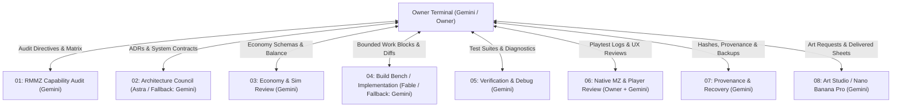

# DEUS BOOTSTRAP PACKETS — MASTER HUB-AND-SPOKE INDEX

**System Authority:** Owner Terminal (Gemini)  
**Creation Date:** 2026-09-22  
**Target Repository:** `C:\Users\snewt\OneDrive\Desktop\UF`  
**System Status:** Bootstrap Packets Prepared & Hub-and-Spoke Topology Initialized  

---

## 1. Hub-and-Spoke Architecture Overview

Project DEUS operates strictly as a centralized Hub-and-Spoke governance network. The **Owner Terminal** acts as the singular routing switch, control tower, and release gatekeeper. Under no circumstances does any specialized spoke communicate or route tasks directly to another spoke.

---

## 2. Master Packet Register

| Packet ID | Spoke Role Name | Designated Model | Fallback Model | Availability State | Packet File Path |
|---|---|---|---|---|---|
| **PACKET-01** | `DEUS — RMMZ Capability Audit` | Gemini | Owner Terminal | `AVAILABLE` | `docs/packets/DEUS_BOOTSTRAP_PACKET_01_RMMZ_CAPABILITY_AUDIT.md` |
| **PACKET-02** | `DEUS — Architecture Council` | Codex Astra Ultra | Gemini | `WAITING_FOR_MODEL_CREDITS` | `docs/packets/DEUS_BOOTSTRAP_PACKET_02_ARCHITECTURE_COUNCIL.md` |
| **PACKET-03** | `DEUS — Economy & Simulation Review` | Gemini | Codex Astra Ultra | `AVAILABLE` | `docs/packets/DEUS_BOOTSTRAP_PACKET_03_ECONOMY_SIMULATION_REVIEW.md` |
| **PACKET-04** | `DEUS — Build Bench / Implementation` | Claude Code Fable Ultra | Gemini | `WAITING_FOR_MODEL_CREDITS` | `docs/packets/DEUS_BOOTSTRAP_PACKET_04_BUILD_BENCH_IMPLEMENTATION.md` |
| **PACKET-05** | `DEUS — Verification, Debug & Performance` | Gemini | Headless CLI / Owner | `AVAILABLE` | `docs/packets/DEUS_BOOTSTRAP_PACKET_05_VERIFICATION_DEBUG_PERFORMANCE.md` |
| **PACKET-06** | `DEUS — Native MZ & Player Review` | Owner + Gemini | Headless Test Runner | `AVAILABLE` | `docs/packets/DEUS_BOOTSTRAP_PACKET_06_NATIVE_MZ_PLAYER_REVIEW.md` |
| **PACKET-07** | `DEUS — Provenance, Assets, Build & Recovery` | Gemini | Owner Terminal | `AVAILABLE` | `docs/packets/DEUS_BOOTSTRAP_PACKET_07_PROVENANCE_ASSETS_BUILD_RECOVERY.md` |
| **PACKET-08** | `DEUS — Art Generation / Asset Studio` | Nano Banana Pro | None (Rule 11) | `AVAILABLE` | `docs/packets/DEUS_BOOTSTRAP_PACKET_08_ART_GENERATION_ASSET_STUDIO.md` |

---

## 3. Core Vision Invariants (Universal Across All Packets)

1. **DEUS is the current project identity.**
2. **RPG Maker MZ is the authoring and deployment environment.**
3. **The game uses an elevated 2.5D presentation.**
4. **Natural-world rules, terrain, resources, and economy must precede full faction and AI implementation.**
5. **Crafting, refining, enchanting, and construction use a shared 3×3 workstation-grid model.**
6. **The old creature AI fields and AI plugin are subject to a deliberate reset and must not be silently preserved.**
7. **OriginalGame must use original creative content.**
8. **MechanicsLab remains isolated for development, proof work, and explicitly authorized reference work.**
9. **U8-derived material must not enter shared runtime code or OriginalGame.**
10. **Performance, FPS, native MZ, visual, provenance, and release checks are required.**
11. **Art requests may originate in the Owner Terminal and route to the art-generation spoke.**
12. **Ideas and complaints go into one Idea Arsenal and work queue.**
13. **Work is divided into bounded blocks with one writer per file or subsystem.**
14. **All specialist results return to the Owner Terminal.**
15. **No spoke routes directly to another spoke.**
