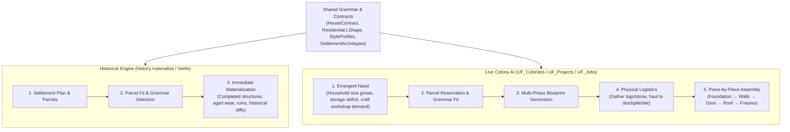
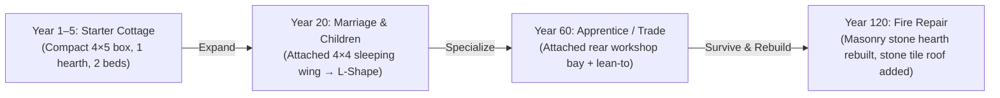

# DEUS_BuildingGrammar — Unified Architectural Grammar, Settlement Planning & Spatial Zoning Specification

**Project Formal Name**: DEUS  
**Authoritative Subsystem**: Construction, AI/Planning, WorldGen & Historical Demographics  
**Status**: Specification Complete (Targeting Milestone: Autonomous Settlement Growth & District Planning)

---

## 1. Dual-Execution Architecture: Shared Language, Decoupled Execution

A foundational rule of Project DEUS architecture is:
> **Historical world generation and live colonist AI share the exact same architectural grammar, contracts, and style data, but execute through decoupled construction pipelines.**



### Architectural Benefits:
1. **Zero Simulation Drag on 500-Year History**: WorldGen does not simulate 500 years of individual hammer swings or hauling steps. It generates authentic, culturally consistent architecture instantly.
2. **Visual Consistency**: Live settlements and ancient historical cities share the same layouts, wall thicknesses, door frontages, and roof profiles. A live colony looks like a living continuation of historical settlements.
3. **Archaeological Stratigraphy**: Historical settlements can record multiple building phases across eras (e.g. an archaic stone foundation with later timber extensions), which the player and colonists discover intact.

---

## 2. The Five-Layer Architectural Stack

Settlement construction operates across five distinct abstraction layers. Decisions flow downward:

```text
Layer 1: Settlement Plan (Circulation Skeleton & Zoning Districts)
   ↓
Layer 2: Plot Fitting & Terrain Adaptation (Parcel Slope, Z-Transitions, Water Frontage)
   ↓
Layer 3: Functional Building Contract (Occupancy, Fixtures, Weatherproofing, Access)
   ↓
Layer 4: Geometric Shape Grammar (L-Shape, Longhouse, Courtyard, Terraced Step)
   ↓
Layer 5: Cultural & Historical Style Profile (Materials, Spacing, Frontage, Roof Style)
```

---

### Layer 1: Settlement Plan & Circulation Skeleton

Settlements are not generated by plopping buildings in an open glade. **Circulation precedes architecture.**

1. **Circulation Hierarchy**:
   - **Primary Arterial Spine (width 2–3)**: Connects city gates, water docks, and regional trade routes to the civic center. Paved with stone or hard-packed gravel.
   - **Secondary Paths (width 1–2)**: Branch organically into residential clusters, cul-de-sacs, and workshops.
   - **Desire Lines**: Frequently traversed routes between high-traffic destinations (e.g. well to Great Hall, mine to forge) naturally wear into footpaths.
2. **Functional Districts & Zoning**:
   - **Civic Core**: Town Hall / Great Hall, tavern/inn, market plaza, communal hearth/well at the primary intersection.
   - **Productive Belt**: Workshops placed near relevant resources and transport (e.g. smith near ore/quarry, sawyer near forest edge, tanner downwind).
   - **Residential Neighborhoods**: Clustered along secondary paths with domestic hearths and garden space.
   - **Agricultural Fringe**: Farms, pastures, granaries, and animal pens on flatter outer parcels.
   - **Defensive Boundary**: Palisade or stone curtain wall, ditch, and watchtowers on high ground or perimeter choke points.
3. **Settlement Archetypes**:
   - `ClusteredVillage`: Concentric growth around a central green, well, or Great Hall.
   - `RibbonVillage`: Linear spine along a trade road or river valley with long perpendicular strip lots.
   - `RiverWharf`: Frontage aligned with water edge (docks, boathouses) with elevated dwellings set back.
   - `HillsideFortress`: Stepped contour-hugging roads climbing a ridgeline or volcanic crag.
   - `CourtyardCompound`: Walled clan compounds separated by narrow defensible alleys.

---

### Layer 2: Plot Fitting & Terrain Adaptation

Before selecting a building shape, the settlement engine evaluates the physical parcel:

```javascript
const parcelFeatures = {
    elevationProfile: "sloped_z0_z1", // flat, stepped, cliff_face, terrace
    waterFrontage: "none",            // river_north, lake_east, none
    cliffAdjacency: "south",          // rock face available as natural structural wall
    roadFrontage: "west",             // primary access side
    availableFootprint: { w: 8, h: 6 },
    obstacleFootprint: ["tree_sacred", "boulder_granite"]
};
```

#### Terrain-to-Grammar Matching Rules:
- **Flat Open Parcel** $\to$ Longhouse, Courtyard Compound, or L-Shape.
- **Steep Elevation Boundary ($Z=0$ to $Z=+1$)** $\to$ Terraced Hillside Dwelling (lower level embedded in slope, upper level stepping back with uphill entrance).
- **Sheer Cliff Face** $\to$ Cliff-Embedded Dwelling (natural rock forms back wall; entrance and windows face open slope).
- **Waterfront Edge** $\to$ Stilt House / Wharf Warehouse (front porch opens directly onto dock; rear connects to footpath).
- **Irregular Street Angle** $\to$ L-Shape or Box with angled porch conforming to street setback.

---

### Layer 3: Functional Building Contracts

Buildings have **functional contracts**, not fixed rectangles. The planner satisfies the contract regardless of the specific shape chosen:

```json
{
  "contractId": "dwelling_family_medium",
  "invariants": {
    "sleepingCapacity": 4,
    "sheltered": true,
    "exteriorAccess": true,
    "hearth": 1,
    "minInteriorWalkable": 12
  },
  "variants": {
    "porch": "optional",
    "privateChamber": "preferred_if_married",
    "storageNook": "preferred",
    "secondStory": "allowed_if_dense"
  }
}
```

- **Invariants (Hard Constraints)**:
  - Must provide $\ge N$ bed/sleeping cells.
  - Must provide 1 domestic cooking hearth or heating fire.
  - Interior cells must be 100% enclosed by walls and covered by a weatherproof roof.
  - At least 1 exterior door must open directly onto a walkable path cell without obstruction.
- **Variants (Soft Preferences)**:
  - Partitions between communal living hall and private sleeping quarters.
  - Storage closets, firewood nooks, or overhang awnings.

---

### Layer 4: Geometric Shape Grammars

Grammars define legal volumetric geometry and procedural topological rules:

#### 1. Compact Rectangle ($4\times5$ to $5\times6$)
- Single interior hall. Hearth on front/lateral wall; sleeping mats against rear wall.
- Efficient, cheap to construct, ideal for pioneer starter cabins or high-density urban cottages.

#### 2. L-Shape Dwelling ($6\times6$ to $8\times8$ bounding box with $3\times3$ or $4\times4$ cut)
- **Living Wing (Main Hall)**: Living area, domestic cooking hearth, exterior entrance door.
- **Sleeping Wing**: Private bedrooms, storage chests.
- **Exterior Nook**: The recessed outdoor angle naturally forms a sheltered entrance porch, firewood stack, or garden patio.

#### 3. Longhouse ($5\times10$ to $6\times16$)
- Narrow, extended longitudinal hall with a central stone-lined hearth aisle.
- Sleeping alcoves and storage benches line both lateral walls.
- High structural efficiency for cold climates, communal clans, and early founder colonies.

#### 4. Courtyard Compound ($10\times10$ to $14\times14$)
- Exterior rooms form an unbroken outer defensive wall.
- All doors and windows open inward into a private, central open-air courtyard.
- Single fortified entrance gate facing the street.

#### 5. Terraced / Hillside Split ($Z=0$ and $Z=+1$)
- Lower Level ($Z=0$): Cellar, pantry, animal stall, or workshop; enters from downhill street.
- Upper Level ($Z=+1$): Residential living hall and hearth; enters from uphill terrace or internal stair.

#### 6. Open-Sided Work Pavilion
- Heavy timber/stone corner posts supporting a full overhead roof, but leaving 2 or 3 sides open.
- Essential for high-heat, smoky crafts: Blacksmith, Bloomery, Charcoal Burner, Smelter.

---

### Layer 5: Cultural & Historical Style Profiles

Style profiles govern **aesthetic weights, material choices, setbacks, and roof conventions**. Crucially, style is **decoupled from pure biological race**:

```json
{
  "styleId": "dwarven_highland_masonry",
  "associations": {
    "primaryCulture": "dwarf",
    "regionalAdaptation": "mountain_uplands",
    "historicalEra": "classical_pre_fracture"
  },
  "materials": {
    "wall": "wall_stone_granite",
    "door": "door_stone",
    "floor": "floor_stone_flagstone",
    "roof": "roof_slate"
  },
  "grammarWeights": {
    "terraced_house": 0.40,
    "compact_rectangle": 0.30,
    "courtyard": 0.20,
    "l_house": 0.10,
    "longhouse": 0.00
  },
  "density": {
    "builtCoverageTarget": 0.70,
    "streetWidth": [1, 2],
    "lotSetback": 0
  },
  "decorations": ["hewn_stone_carving", "runic_lintel"]
}
```

#### Why Decoupling Style from Race Matters:
1. **Multi-Species Settlements**: An elven merchant living in a human port city occupies a timber row-house with elven interior furnishings, rather than a living tree abruptly planted in the town square.
2. **Archaeological Discovery & Environmental Lore**:
   - The player discovers ancient cyclopean stone ruins in an elven glade. Because the architecture belongs to the `imperial_archaic` style profile, the player deduces that an ancient human empire ruled this valley centuries before the elves arrived.
3. **Conquered / Inherited Cities**: Factions conquer, repair, and modify existing buildings rather than bulldozing and rebuilding from scratch.

---

## 3. Additive Building Extensibility (Architectural Stratigraphy)

Real historical buildings are **extended additively**, not demolished and replaced with larger boxes:



### Extensibility Grammar Rules:
- **Sleeping Wing Addition**: Attaches to the rear or short lateral wall; knocks out a 1-tile doorway. Converts a compact rectangle into an L-shape or T-shape.
- **Workshop / Storage Annex**: Attaches an open-sided or timber lean-to against a blank exterior wall.
- **Second-Story Dormer / Attic Loft**: If parcel density prevents lateral expansion, the household builds a vertical stair and encloses $Z=+1$.
- **Compound Enclosure**: Multiple adjacent family structures build a shared perimeter wall, creating an emergent courtyard.

---

## 4. Frontage, Setbacks & Intentional Negative Space

### The Frontage Orientation Rule:
Every parcel has a designated **Frontage Vector** $\vec{F}$ pointing toward the nearest road, path, or civic square:
- **Main Entrance Door**: Must face $\vec{F}$ (toward the street).
- **Service Doors / Storage Nooks**: Oriented away from $\vec{F}$ (toward the rear yard or alley).
- **Windows**: Placed primarily on the frontage and courtyard walls; minimized on party walls facing neighbors.

### Intentional Negative Space (The Anti-Grid Rule):
Naïve procedural generation packs every free cell, creating monotonous warehouse grids. DEUS settlements enforce **Target Built Coverage Ratios**:

| Settlement Archetype | Built Area Ratio | Negative Space Character |
|---|---|---|
| **Dispersed Glade** | $15\% - 30\%$ | Wild meadows, sacred groves, meandering streams between dwellings. |
| **Pioneer Hamlet / Human Village** | $30\% - 50\%$ | Fenced vegetable gardens, firewood yards, communal greens, livestock pens. |
| **Trade Town / Port** | $55\% - 70\%$ | Paved market plazas, side alleys, carriage yards, covered loading docks. |
| **Dwarven Mountain Citadel** | $65\% - 80\%$ | Tight stone chasms, monumental staircases, defensible lightwells. |

---

## 5. Canonical Data Schemas

### Building Contract Specification (`BuildingContract`)
```typescript
interface BuildingContract {
    id: string;                      // e.g. "contract_residential_medium"
    purpose: "residential" | "workshop" | "civic" | "defense" | "agricultural";
    capacityRequirements: {
        sleepingBeds?: number;       // min sleeping capacity
        craftStations?: string[];    // required tool stations ["forge", "anvil"]
        storageVolume?: number;      // required loose / container storage slots
        hearthRequired?: boolean;    // true if indoor cooking/heat fire required
    };
    spatialRequirements: {
        minInteriorArea: number;     // e.g. 16 cells
        maxFootprintArea: number;    // e.g. 48 cells
        doorways: {
            frontage: number;        // e.g. 1 main entrance
            service?: number;        // e.g. 1 rear exit
        };
        weatherproofRoof: boolean;   // true for insulated structures
    };
}
```

### Shape Grammar Template (`ShapeGrammar`)
```typescript
interface ShapeGrammar {
    id: string;                      // e.g. "grammar_l_house"
    archetype: "rectangle" | "l_shape" | "longhouse" | "courtyard" | "terraced" | "pavilion";
    boundingLimits: {
        minW: number; maxW: number;
        minH: number; maxH: number;
    };
    zones: {
        primaryHall: { minW: number; minH: number; requiredFixtures: string[] };
        annexWing?: { minW: number; minH: number; requiredFixtures: string[] };
        courtyardOrPorch?: { location: "inner_corner" | "perimeter" | "front" };
    };
    allowedExpansions: ("lateral_wing" | "rear_annex" | "upper_loft" | "perimeter_wall")[];
}
```

---

## 6. Implementation Roadmap

1. **Phase 1 (Data & Geometry Foundation)**:
   - Implement `DEUS_BuildingGrammar.js` containing geometric shape grammar generation algorithms (L-shapes, longhouses, courtyards, terraces) and contract verification functions.
2. **Phase 2 (Plot Fitting & Road Precedence)**:
   - Implement parcel evaluation over 3D terrain ($Z0, Z1, Z2$, slopes, cliff adjacency, road frontage).
3. **Phase 3 (Historical Settlement Materialization)**:
   - Integrate with `DEUS_History.js` (`History.settle` and `History.generate`): materialize diverse, culturally stylized historical settlements across Year 100–500.
4. **Phase 4 (Live Autonomous Colony Expansion)**:
   - Wire into `DEUS_Projects.js` and `DEUS_Colonists.js`: when households grow or trades specialize, colonists stake zoned plots and construct additive extensions piece-by-piece.
