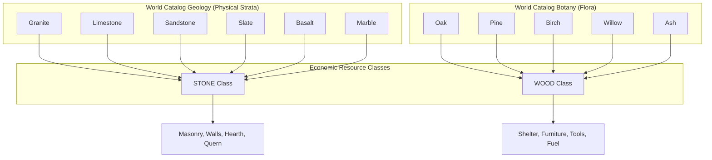
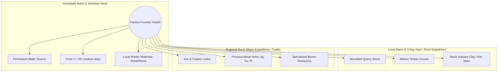

# DEUS Resource Economy & WorldGen Standard
## Finite Materials + Renewable Ecology + Physical Currency (Balance v0.1)

**Standard Document ID:** `DEUS-ECON-STD-01`  
**WBS Leaf ID:** `DEUS-ECON-01` / `DEUS-TSK-FABLE-20`  
**Authoritative Version:** 1.0.0 (Balance v0.1 Calibration)  
**Date:** 2026-09-24  
**Author:** Gemini (DEUS Coordinator / Integration Authority)  
**Status:** FROZEN SYSTEM STANDARD — AWAITING FABLE IMPLEMENTATION (Gated behind FABLE-19 Geometry)  
**Machine-Readable Registry:** [`game/data/DEUS_ResourceRegistry.json`](file:///c:/Users/snewt/OneDrive/Desktop/UF/game/data/DEUS_ResourceRegistry.json)  

---

### Executive Summary & Binding Directives

This technical standard establishes the fundamental resource economy, geological deposit placement, ecological regrowth, physical currency, and material conservation laws for Project DEUS. Resources do not scatter randomly across cells; they emerge systematically from **physical geology**, **biome identity**, **macro-Z elevation**, **ecological silviculture**, and **strict physical conservation ledgers**.

#### Core Architectural Axioms
1. **Many World Materials → Few Economic Classes:** Physical variety in geology, woods, and ores remains visually authentic and geologically distinct, but game systems and crafting recipes compress them into a small set of canonical economic classes (`STONE`, `WOOD`, `FOOD`, `WATER`, `FIBER`, `IRON`, `COPPER`, `SILVER`, `GOLD`, `PLATINUM`, `STEEL`, `ELECTRUM`).
2. **Strict Material Conservation Law:** Stone and all finite metals cannot be created from nothing and cannot vanish from the world. Once generated at New Game, their mass is constant across all transformations:
   $$\text{WORLD\_TOTAL}(R) = \sum \text{NaturalDeposits} + \sum \text{LooseStock} + \sum \text{Inventories} + \sum \text{Constructed} + \sum \text{Coins} + \sum \text{Scrap/Rubble}$$
3. **Physical Currency & Alloyed Electrum:** Coins (`cp`, `sp`, `ep`, `gp`, `pp`) are stamped physical metal minted by factions. Electrum is an alloy manufactured strictly from $50\%\ \text{Gold} + 50\%\ \text{Silver}$; **zero natural electrum deposits exist in the world**.
4. **Slow Ecological Silviculture:** Trees are very slow renewables requiring decadal maturity cycles ($15\text{ years}$ for mature timber). Clear-cutting eliminates seed canopies and causes long-term strategic timber deficits.
5. **Universal Viability, Not Uniform Wealth:** Starting settlement zones guarantee survival opportunity (minimum $720\text{ creature-days}$ food, permanent water, local shelter materials), but regional access to heavy iron or precious metals varies widely, driving trade, diplomacy, and expansion.

---

### 1. World Scale & Population Baseline

The world generation space for Project DEUS is a bounded multi-layer volumetric grid:

$$\text{World Dimensions} = 256 \times 256\ \text{cells} \times 5\ \text{macro Z levels} = 327,680\ \text{macro cells}$$

Each macro cell ($5\ \text{ft} \times 5\ \text{ft}$ footprint) contains $5$ vertical physical strata ($1\ \text{ft}$ height each):

$$\text{Total World Strata} = 327,680 \times 5 = 1,638,400\ \text{strata}$$

$$\text{Total World Physical Volume} = 1,638,400 \times 25\ \text{cu ft} = 40,960,000\ \text{cubic feet}$$

#### Population Scale & Demographics
- **Initial Founders:** $9\ \text{Factions} \times 8\ \text{Founders} = 72\ \text{initial living colonists}$.
- **Target Design Population:** $1,200\ \text{creatures}$ across settled societies, outposts, and mature mountainhalls (providing head-room above the $1,000+$ creature milestone).
- **Annual Food Baseline:** At $1\ \text{food unit/day}$, the $1,200\ \text{creature}$ population consumes $438,000\ \text{creature-days/year}$.

---

### 2. Canonical Initial Racial Spawn Anchors

In accordance with DEUS Canon (Directive 2026-09-24, V132), races possess designated **world-generation spawn anchors** tied to elevation strata. These are initial settlement anchors only, **not permanent habitat restrictions**. Subsequent historical simulation, migration, marriage, trade, and conquest organically relocate populations across all levels.

| Macro Z Level | Physical Strata Elevation | Cultural Races | Ecological Zone / Habitat Type |
|---|---|---|---|
| **`Z-2`** | $-10\ \text{ft}$ to $-6\ \text{ft}$ | **Tiefling, Dragonborn** | Deep subterranean magma/chasm caverns, geothermal basins, primordial basalt |
| **`Z-1`** | $-5\ \text{ft}$ to $-1\ \text{ft}$ | **Dwarf, Gnome** | Shallow subterranean karst, mineral-rich mountain halls, slate/limestone chambers |
| **`Z0`** | $0\ \text{ft}$ to $+4\ \text{ft}$ | **Human, Half-Orc** | Surface lowlands, river valleys, temperate meadows, open plains, arable floodplains |
| **`Z+1`** | $+5\ \text{ft}$ to $+9\ \text{ft}$ | **Halfling, Half-Elf** | Elevated rolling terraces, plateau fringes, orchard hills, low woodlands |
| **`Z+2`** | $+10\ \text{ft}$ to $+14\ \text{ft}$ | **Elf** | High mountain scarps, ancient highland groves, alpine ridges, high canopy bastions |

---

### 3. Core Economic Philosophy: Many Materials → Few Classes

To prevent inventory explosion, pathfinding stalls, and brittle crafting recipes, the economy operates on **compressed functional classes**. Real geological variety is preserved in world generation and physical rendering, but abstracted at the crafting and economic ledger interface:



- **Physical Material Identity Preserved:** Specific material IDs (`limestone`, `oak`, `hematite`) remain authoritative for visual sprite lookups, structural HP, support values, flammability, and rare specialized recipes.
- **Economic Class Consumption:** Standard blueprints (e.g. `wall_stone`, `hearth`, `chest_wood`, `bed`) consume generic economic units from the active class (`STONE`, `WOOD`), pulling available local variants without hardcoded species locking.

---

### 4. Canonical Core Resource Classes & Balance Targets v0.1

| Resource Class | Renewability | Conserved | World Target (Balance v0.1) | Deposit Targets | Key Economic Roles |
|---|---|---|---|---|---|
| **`FOOD`** | Fast Renewable | No | $25,000\ \text{initial wild stock}$; $650,000\ \text{days/yr sustainable}$ | Biome / Fauna | Metabolic subsistence, stamina, growth, trade |
| **`WATER`** | Fast Renewable | No | Universal local access guaranteed | Aquifers / Rivers | Hydration, irrigation, firefighting, refining |
| **`FIBER`** | Fast Renewable | No | $120,000\ \text{units/yr capacity}$ | Flora / Fauna | Thread, cloth, bedding, cordage, sacks |
| **`WOOD`** | Slow Renewable | No | $25,000\ \text{mature}$; $10,000\ \text{young trees}$ | Forests / Groves | Structural framing, timber, furniture, fuel |
| **`STONE`** | Finite | **Yes** | $650,000\ \text{strata}$ ($16.25\ \text{M cu ft}$) | Geological Strata | Fortifications, hearths, furnaces, mills |
| **`IRON`** | Finite | **Yes** | $80,000\ \text{refined economic units}$ | $100\text{–}150\ \text{lodes}$ | Tools, armaments, steel manufacturing |
| **`COPPER`** | Finite | **Yes** | $40,000\ \text{refined economic units}$ | $60\text{–}100\ \text{lodes}$ | Base coinage (`cp`), bronze, hardware, pipes |
| **`SILVER`** | Finite | **Yes** | $4,000\ \text{refined economic units}$ | $25\text{–}40\ \text{veins}$ | Standard coinage (`sp`), electrum, prestige |
| **`GOLD`** | Finite | **Yes** | $400\ \text{refined economic units}$ | $10\text{–}20\ \text{pockets}$ | High coinage (`gp`), electrum, tribute |
| **`PLATINUM`** | Finite | **Yes** | $40\ \text{refined economic units}$ | $3\text{–}8\ \text{chimneys}$ | Apex coinage (`pp`), legendary artifacts |
| **`STEEL`** | Manufactured | **Yes** | $0\ \text{natural deposits}$ (Iron derivative) | Smelter Recipes | Superior weapons, heavy plate, masterwork gates |
| **`ELECTRUM`** | Manufactured | **Yes** | $0\ \text{natural deposits}$ ($50/50\ \text{Au+Ag}$) | Mint / Foundry | Intermediate currency (`ep`), ceremonial plate |

---

### 5. Material Conservation Law & Ledger Invariants

For all finite conserved classes (`STONE`, `IRON`, `COPPER`, `SILVER`, `GOLD`, `PLATINUM`), the total mass in the simulation is sealed upon completion of world generation.

#### The Conservation Invariant Formula
$$\text{WORLD\_TOTAL}(R) = N_{\text{deposits}} + S_{\text{loose}} + I_{\text{inventory}} + B_{\text{constructed}} + E_{\text{equipment}} + C_{\text{currency}} + R_{\text{salvage}} + P_{\text{staging}}$$

Where:
- $N_{\text{deposits}}$: Unmined natural strata holding ore or stone.
- $S_{\text{loose}}$: Raw quarried boulders, ore chunks, and refined ingots sitting in stockpiles or ground containers.
- $I_{\text{inventory}}$: Materials held in creature backpacks or warehouse containers.
- $B_{\text{constructed}}$: Finished walls, floors, doors, hearths, furnaces, and furniture.
- $E_{\text{equipment}}$: Weapons, shields, armor, tools, and hardware in active service.
- $C_{\text{currency}}$: Circulating, hoarded, or vaulted physical coins.
- $R_{\text{salvage}}$: Broken scrap metal, masonry rubble, and fragments waiting for reclamation.
- $P_{\text{staging}}$: Materials reserved in active construction project blueprints.

#### State Transition Cycle
Conserved resources cannot be garbage-collected or deleted upon damage/destruction:
1. **Extraction:** Mining a solid ore stratum converts $N_{\text{deposits}} \to S_{\text{loose}}$ and leaves an open/rubble stratum.
2. **Manufacture:** Smelting and smithing converts $S_{\text{loose}} \to E_{\text{equipment}}$ or $B_{\text{constructed}}$.
3. **Wear & Destruction:** When an iron sword breaks or a stone wall is battered down, its structural HP drops to $0$. It **immediately transforms into reclaimable scrap or rubble**:
   - $1\ \text{broken iron sword} \to 1\ \text{scrap iron piece}$ ($100\%$ metal recovery upon remelting).
   - $1\ \text{destroyed stone wall} \to 1\ \text{rubble pile}$ ($80\text{–}100\%$ recoverable stone blocks).
4. **Starter Kit Conservation:** Founder equipment, starting tools, and embark coin bags are **debited directly from the world total** at generation. No free matter is spawned ex nihilo.

---

### 6. Geological Deposit-Generation Specification

To ensure geological plausibility and avoid chaotic single-pixel ore noise, mineral placement follows a 4-tier structural hierarchy:

```text
1. GEOLOGICAL PROVINCE
   └── Regional tectonic/plutonic domain (Igneous Pluton, Sedimentary Basin, Metamorphic Scarp)
       └── 2. HOST GEOLOGY
           └── Compatible rock strata (Granite, Limestone, Basalt, Slate)
               └── 3. DEPOSIT FIELD & VEIN MORPHOLOGY
                   └── Multi-cell continuous geometric bodies (Vein, Lode, Pipe, Pocket)
                       └── 4. ORE-BEARING STRATA
                           └── Physical 1 ft strata holding ore grades and recovery units
```

#### Deposit Morphologies
- **Tabular Fissure Veins:** Narrow, steeply dipping planar bodies spanning across multiple Z levels (predominant for Gold, Silver, and Copper in igneous rock).
- **Stratiform Lodes:** Wide, gently undulating horizontal sheets conforming to sedimentary beds (predominant for Iron and Copper in limestone/sandstone).
- **Breccia Pipes / Volcanic Chimneys:** Sub-vertical cylindrical bodies originating in `Z-2` and venting upward toward volcanic fissures (predominant for Platinum and Volcanic Minerals).
- **Disseminated Pockets:** Irregular localized clusters embedded within contact metamorphic aureoles.

#### Macro-Z Depth Distribution Weights
Mineral depth distributions reflect natural crustal differentiation:

| Economic Class | `Z+2` (High) | `Z+1` (Terrace) | `Z0` (Surface) | `Z-1` (Karst) | `Z-2` (Deep) | Target Sum |
|---|---|---|---|---|---|---|
| **`IRON`** | $10\%$ | $15\%$ | $20\%$ | $25\%$ | $30\%$ | $100.0\%$ |
| **`COPPER`** | $10\%$ | $15\%$ | $20\%$ | $25\%$ | $30\%$ | $100.0\%$ |
| **`SILVER`** | $5\%$ | $10\%$ | $15\%$ | $30\%$ | $40\%$ | $100.0\%$ |
| **`GOLD`** | $2\%$ | $8\%$ | $15\%$ | $30\%$ | $45\%$ | $100.0\%$ |
| **`PLATINUM`** | $0\%$ | $5\%$ | $10\%$ | $25\%$ | $60\%$ | $100.0\%$ |

#### Biome Mineral & Material Biases

| Biome ID | Biomass & Forestry Bias | Stone & Mineral Bias | Metallurgical / Mining Character |
|---|---|---|---|
| **`TEMP`** | High Food ($1.4\times$), High Wood ($1.6\times$) | Moderate Stone ($0.8\times$) | Rich surface timber, bog iron, shallow copper, alluvial gravels |
| **`WET`** | High Water ($2.0\times$), High Fiber ($1.8\times$) | Low Surface Stone ($0.4\times$) | Peat/bog iron extraction; surface stone obscured; deep metals present |
| **`ARID`** | Low Biomass ($0.2\times$), Low Wood ($0.1\times$) | High Exposed Rock ($1.2\times$) | Excellent surface vein visibility; copper, silver, and sandstone |
| **`HIGH`** | Moderate Alpine Wood ($0.7\times$) | Very High Granite ($1.8\times$) | Abundant quarry stone; prominent iron, copper, and gold quartz veins |
| **`VOLC`** | Low Ordinary Biomass ($0.1\times$) | Extreme Basalt/Obsidian ($1.8\times$) | Deep chimney deposits; abundant copper, gold, platinum, and sulfur |

---

### 7. Renewable Ecology: Silviculture & Subsistence

#### Wood Forestry Dynamics (Slow Renewable)
Trees do not respawn on arbitrary game timers. Silviculture is governed by continuous ecological rules:
- **Tree Life Stages:**
  - *Sapling:* $0\text{–}1\ \text{year}$ (Produces fiber/branches; zero structural timber).
  - *Young Tree:* $2\text{–}4\ \text{years}$ (Produces $2\ \text{timber units}$).
  - *Mature Tree:* $5\text{–}15\ \text{years}$ (Produces $10\ \text{timber units}$).
  - *Ancient / Landmark:* $16\text{–}50+\ \text{years}$ (Produces $25\ \text{timber units}$).
- **Regeneration Differential:**
  $$\Delta \text{Trees} = \left( T_{\text{mature}} \times K_{\text{dispersion}} \times S_{\text{soil}} \times C_{\text{climate}} \right) - H_{\text{harvest}}$$
- **Anti-Clear-Cutting Invariant:** Selective logging leaves seed trees that regenerate canopy in $5\text{–}10\ \text{years}$. Total clear-cutting strips the local seed bank, requiring windborne migration across decades ($25\text{–}50\ \text{years}$) to re-establish forest cover.

#### Food & Carrying Capacity (Fast Renewable)
- **Design Target:** The global initial ecosystem provides $\sim 25,000\ \text{creature-days}$ of unharvested wild stock (berries, forage, wild game, river fish).
- **Sustainable Yield:** Under agricultural cultivation and managed hunting/husbandry, the world sustains $650,000\ \text{creature-days/year}$.
- **Carrying Capacity Ceiling:**
  $$\text{Max Stable Population} = \frac{650,000\ \text{creature-days}}{365\ \text{days/year}} \approx 1,780\ \text{creatures}$$
  This provides comfortable support for the $1,200$ design population while generating regional food pressure in arid, volcanic, or over-populated biomes.

---

### 8. Physical Currency, Minting, & Coin Provenance

DEUS currency conforms to SRD 5.1 denominations, backed by physical conserved metal:

| Denomination | Abbreviation | Base Metal | Value in `cp` | Metal Units per 100 Coins |
|---|---|---|---|---|
| **Copper Piece** | `cp` | `COPPER` | $1\ \text{cp}$ | $100\ \text{units Copper}$ |
| **Silver Piece** | `sp` | `SILVER` | $10\ \text{cp}$ | $100\ \text{units Silver}$ |
| **Electrum Piece** | `ep` | `ELECTRUM` | $50\ \text{cp}$ | $50\ \text{units Gold} + 50\ \text{units Silver}$ |
| **Gold Piece** | `gp` | `GOLD` | $100\ \text{cp}$ | $100\ \text{units Gold}$ |
| **Platinum Piece** | `pp` | `PLATINUM` | $1,000\ \text{cp}$ | $100\ \text{units Platinum}$ |

#### The Electrum Rule
**MANDATORY:** Zero natural electrum ores or veins are generated in the world. Electrum exists exclusively as a manufactured metallurgical alloy created in foundry crucibles or faction mints by blending equal parts refined Gold and Silver.

#### Coin Provenance Metadata
To eliminate memory overhead, individual coins are never represented as live JS entity objects. Coins exist exclusively as compact metadata attached to currency stacks:

```json
{
  "denomination": "sp",
  "metal": "SILVER",
  "mintFaction": "faction_dwarf_ironclad",
  "mintEra": 12,
  "quantity": 140
}
```

- **International Circulation:** Factions mint their own coins marked with cultural stamps. Foreign coins are accepted in trade at intrinsic bullion parity or discounted by local tariffs.
- **Melting & Reminting:** Factions with minting workshops can melt captured foreign coin stacks back into raw metal ingots or re-stamp them into their sovereign currency. Metal mass is strictly conserved ($100\%$ return).

---

### 9. Settlement Viability & Accessibility Bands

Starting locations must guarantee **survival opportunity**, not effortless abundance. Every generated faction start is verified against three concentric accessibility radii:



#### Starting Guarantees per 8-Founder Party
1. **Permanent Water Access:** A natural river, spring, lake, or high-water-table aquifer must sit within the immediate band.
2. **Immediate Food Reserve:** Natural forage, game, or fish within $1\ \text{workday}$ must provide at least $720\ \text{creature-days}$ of sustenance ($90\ \text{days}$ of food for $8$ founders), ensuring ample time to establish agriculture.
3. **Local Construction Material:** Sufficient nearby logs or surface stone to erect a basic communal shelter, storage chest, and bedding.
4. **Starter Tools Accounted in Ledger:** The metal in starting axes, picks, and swords is debited from the world total at world generation.
5. **No Guaranteed Iron Mine:** Starts are **not** guaranteed a local iron mine. Non-iron settlements must rely on tool conservation, salvage, stone masonry, wooden architecture, and external trade expeditions.

---

### 10. Headless Balance Simulation & Verification Plan

To prove economic stability across deep history, the simulation harness must execute deterministic long-horizon balance audits.

#### Testing Parameters
- **Sample Target:** $1,000$ deterministic seeds.
- **Horizon Intervals:** $1\ \text{year}$, $5\ \text{years}$, $20\ \text{years}$, $100\ \text{years}$, and $500\ \text{years}$.
- **Monitored Telemetry:**
  - Depletion rate of regional timber vs ecological regrowth curve.
  - Per-faction food stocks and starvation incident frequency.
  - Conservation ledger balance:
    $$\Delta \text{Ledger} = \text{WORLD\_TOTAL}_{\text{end}} - \text{WORLD\_TOTAL}_{\text{start}} \equiv 0$$
  - Trade volume, coin circulation, and reminting cycles.
  - Colony viability failure rates (must be $<1.0\%$ due to unviable worldgen terrain).

---

### 11. Bounded Implementation Handoff to Fable (`DEUS-TSK-FABLE-20`)

#### Task Sequencing & Gate Rule
**CRITICAL:** Implementation of `DEUS-TSK-FABLE-20` is **strictly gated behind the completion and coordinator review of `DEUS-TSK-FABLE-19B` (Cuts + Caves on Strata) and `19C` (Vertical Exposure)**. The resource generation pass must place mineral veins directly into **authoritative physical strata**, never into legacy shape grids or obsolete cell arrays.

#### Implementation Scope for Fable
1. **Catalog & Registry Integration:** Load and enforce `game/data/DEUS_ResourceRegistry.json`.
2. **Geological Vein Generator:** Implement coherent 3D vein/lode deposition conforming to the 4-tier hierarchy.
3. **Macro-Z Metal Allocation:** Apply normalized depth weights to mineral distribution.
4. **Conservation Ledger Service:** Implement runtime tracking of conserved materials across mining, crafting, destruction, and salvage.
5. **Viability Audit Gate:** Add automated start-location validation checking food, water, and shelter reach.
6. **Automated Test Harness:** Verify ledger invariance ($\text{Balance} = 0$) across extensive crafting/destruction cycles.
