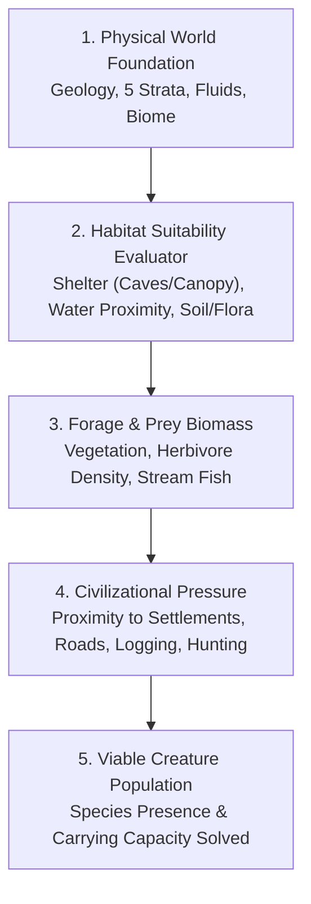
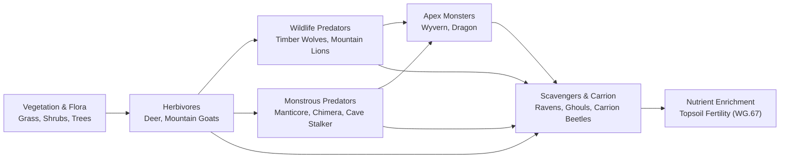

# DEUS — Creature Ecology Unification Specification
**Authoritative Architectural Specification & Semantic Creature Standard**  
**Document ID:** `DEUS-CREAT-ECO-v1.0`  
**Integration Authority:** Gemini / Antigravity (DEUS Coordinator)  
**Approved by Owner Directive:** 2026-09-25  

---

## 1. Executive Mandate & Canonical Principle

> **"DEUS uses one underlying living-world ecology framework for ordinary wildlife, monsters, domesticated creatures, and other non-civilization creatures where their nature permits. Wildlife and monsters may differ in lore, danger, behavior, reproduction, diet, magical requirements, or environmental effects, but they should not use completely separate population/spawn architectures without a documented reason."**

### Core Architectural Mandates
1. **Shared Living Foundation:** A timber wolf and a fantastical subterranean predator behave differently, but both participate in the exact same underlying world systems: habitat suitability, food, water, territory, predators, prey, reproduction, migration, mortality, environmental disturbance, and carrying capacity.
2. **One Authoritative Physical World:** Worldgen and live simulation operate on one authoritative physical world and the canonical authorities of its subsystems. No separate generated-world and simulation-world representations may compete. Five-strata geometry (`DEUS_Levels.js`) remains authoritative for solid physical terrain. Fluid volume remains governed by the canonical fluid representation (`DEUS_Fluid.js`) reconciled against strata capacity and passage rules.
3. **Habitat Suitability Over Random Spawn Timers:** Creatures do not materialize out of thin air because an invisible timer elapsed at a "spawn point." Creature populations exist because the physical world satisfies their environmental requirements (biomes, strata levels, moisture, cave shelter, food sources, civilization distance).
4. **Persistent Populations Over Magical Respawns:** Overhunting a species reduces its regional population and can lead to **local extirpation**. Eradicated populations do not automatically respawn; they recover only through biological reproduction of survivors or migration from adjacent un-depleted regions.
5. **Catalogue-First Creature Art Integration:** No visual asset for any wildlife, monster, or domesticated creature may be generated before the species is registered in the **Master Semantic Creature Catalogue** (`WG.68.15`), its ecology profile is defined, its animation requirements are specified, and permanent runtime sheet coordinates are allocated.
6. **Multi-Timescale Performance Compliance:** Complex creature AI and kinematics execute strictly on Tier A (visible/engaged) and Tier B (nearby). Remote populations simulate coarsely at hours, days, and seasons, consuming near-zero CPU. Complies with [`docs/PERFORMANCE_ARCHITECTURE.md`](file:///c:/Users/snewt/OneDrive/Desktop/UF/docs/PERFORMANCE_ARCHITECTURE.md). Exact update frequencies are established by empirical profiling rather than premature freezing.

---

## 2. Living-World Ecology Structure

To maximize architectural reuse while respecting fantasy lore, DEUS classifies all living and animated entities into one unified hierarchy:

```text
┌─────────────────────────────────────────────────────────────────────────────┐
│                         LIVING-WORLD ECOLOGY TAXONOMY                       │
├─────────────────────────┬─────────────────────────┬─────────────────────────┤
│ 1. PRIMARY PRODUCERS    │ 2. BIOLOGICAL FAUNA     │ 3. MONSTERS & BEASTS    │
│    (WBS WG.67 & WG.68)  │    (WBS WG.68)          │    (WBS WG.68)          │
├─────────────────────────┼─────────────────────────┼─────────────────────────┤
│ • Climax trees & flora  │ • Small game (rabbits)  │ • Fantastical beasts    │
│ • Shrubs & grasslands   │ • Large grazers (deer)  │ • Apex predators        │
│ • Cave mosses & fungi   │ • Apex wildlife (bears) │ • Subterranean horrors  │
│ • Aquatic weeds/algae   │ • Domestic livestock    │ • Karst cave predators  │
├─────────────────────────┴─────────────────────────┴─────────────────────────┤
│ 4. SUPERNATURAL & NON-BIOLOGICAL ENTITIES (ECOLOGICAL EXCEPTIONS)           │
├─────────────────────────────────────────────────────────────────────────────┤
│ • Undead (Necrotic animation; zero metabolism, zero biological reproduction)│
│ • Elementals (Arise from extreme geological, thermal, or fluid conditions)  │
│ • Constructs (Artificially manufactured; zero ecological lifecycle)         │
│ • Summoned Entities (Temporary planar visitors bounded by magical duration) │
│ • Extraplanar Beings (Immigrate via portals/rifts rather than local birth)   │
│ • Slimes & Fungal Horrors (Asexual division driven by moisture and carrion) │
│ • Ancient Dragons & Great Beasts (Centuries-long lifespans, vast territories)│
└─────────────────────────────────────────────────────────────────────────────┘
```

---

## 3. Shared Creature Ecology Specification Schema

All ordinary wildlife, domesticated animals, and biological monsters share this foundational data schema:

```json
{
  "$schema": "https://json-schema.org/draft/2020-12/schema",
  "title": "DEUS Shared Creature Ecology Profile",
  "type": "object",
  "required": [
    "speciesId",
    "displayName",
    "category",
    "trophicLevel",
    "habitatRequirements",
    "diet",
    "territoryProfile",
    "populationDynamics",
    "disturbanceResponses",
    "civilizationRelationship"
  ],
  "properties": {
    "speciesId": { "type": "string", "description": "Canonical ID (e.g. CREAT_WOLF_TIMBER, CREAT_BEAST_CAVE_STALKER)" },
    "displayName": { "type": "string" },
    "category": { "type": "string", "enum": ["WILDLIFE", "MONSTER", "DOMESTIC", "SUPERNATURAL_EXCEPTION"] },
    "trophicLevel": { "type": "string", "enum": ["HERBIVORE", "CARNIVORE", "OMNIVORE", "SCAVENGER", "APEX_PREDATOR", "SPECIAL"] },
    "habitatRequirements": {
      "type": "object",
      "properties": {
        "preferredBiomes": { "type": "array", "items": { "type": "string" } },
        "preferredZLevels": { "type": "array", "items": { "type": "integer" } },
        "temperatureRange": { "type": "array", "items": { "type": "number" }, "description": "[minC, maxC]" },
        "moistureRange": { "type": "array", "items": { "type": "string" }, "description": "['DRY', 'NORMAL', 'MOIST', 'SATURATED']" },
        "requiresOpenWater": { "type": "boolean" },
        "requiresCaveShelter": { "type": "boolean" },
        "minimumCanopyCover": { "type": "number", "description": "0.0 to 1.0" }
      },
      "required": ["preferredBiomes", "preferredZLevels"]
    },
    "diet": {
      "type": "object",
      "properties": {
        "foodCategories": { "type": "array", "items": { "type": "string" } },
        "primaryPreySpecies": { "type": "array", "items": { "type": "string" } },
        "dailyCaloricNeed": { "type": "number" },
        "starvationToleranceDays": { "type": "integer" }
      }
    },
    "territoryProfile": {
      "type": "object",
      "properties": {
        "homeRangeRadiusTiles": { "type": "integer" },
        "lairType": { "type": "string", "enum": ["NONE", "BURROW", "DEN", "NEST", "CAVE_LAIR", "RUIN_LAIR", "WATER_LAIR"] },
        "socialStructure": { "type": "string", "enum": ["SOLITARY", "PAIR", "PACK", "HERD", "COLONY"] },
        "groupSizeRange": { "type": "array", "items": { "type": "integer" } }
      }
    },
    "populationDynamics": {
      "type": "object",
      "properties": {
        "carryingCapacityPerArea": { "type": "integer", "description": "Sustainable density per 256x256 area" },
        "reproductionSeason": { "type": "string", "enum": ["SPRING", "SUMMER", "AUTUMN", "WINTER", "YEAR_ROUND"] },
        "gestationDays": { "type": "integer" },
        "litterSize": { "type": "array", "items": { "type": "integer" } },
        "maturationDays": { "type": "integer" },
        "lifespanYears": { "type": "integer" },
        "migrationCapability": { "type": "string", "enum": ["SEDENTARY", "ALTITUDE_SEASONAL", "REGIONAL_NOMADIC"] }
      }
    },
    "disturbanceResponses": {
      "type": "object",
      "properties": {
        "wildfireResponse": { "type": "string", "enum": ["FLEE_IMMEDIATE", "BURROW_SHELTER", "ATTRACTED"] },
        "droughtResponse": { "type": "string", "enum": ["MIGRATE_WATER", "POPULATION_CRASH", "DORMANT"] },
        "civilizationTolerance": { "type": "string", "enum": ["AVOIDANT", "INDIFFERENT", "OPPORTUNISTIC_RAIDER", "ATTRACTED_TO_SETTLEMENTS"] }
      }
    },
    "civilizationRelationship": {
      "type": "object",
      "properties": {
        "huntingValue": { "type": "array", "items": { "type": "string" }, "description": "['meat', 'hide', 'bone', 'trophy']" },
        "threatLevel": { "type": "string", "enum": ["HARMLESS", "DEFENSIVE", "AGGRESSIVE_TERRITORIAL", "PREDATORY_MAN_EATER"] },
        "domesticationPotential": { "type": "boolean" }
      }
    }
  }
}
```

---

## 4. Monster-Specific Extension & Override Model

Fantastical monsters extend the shared ecology schema by declaring explicit overrides and supernatural parameters:

```json
{
  "monsterExtensions": {
    "magicalHabitatRequirement": {
      "manaDensityThreshold": 0.40,
      "corruptionAffinity": "NECROTIC",
      "geothermalAffinity": "HIGH_HEAT"
    },
    "supernaturalDiet": {
      "requiresBiologicalFood": false,
      "consumedResource": "ARCANE_MANA_OR_SOULS",
      "killsLivestockForSport": true
    },
    "supernaturalReproduction": {
      "method": "CORRUPTION_SPAWN",
      "catalyst": "UNBURIED_CORPSES_OR_CURSED_GROUND",
      "frequencyYears": 5
    },
    "lairAttributes": {
      "lairType": "CURSED_CAVE_CRYPT",
      "emitsEnvironmentalAura": "DESECRATED_GROUND",
      "auraRadiusTiles": 16,
      "attractsScavengers": true
    },
    "territorialHazards": {
      "blocksTradeRoads": true,
      "contaminatesDownstreamWater": true,
      "terrorizesSettlementColonists": true
    }
  }
}
```

### The Ecological Exceptions Framework
Where creature lore rejects normal biological constraints, explicit exception flags bypass the baseline lifecycle without requiring a separate engine subsystem:

| Exception Class | Ecological Bypasses & Overrides | World Interaction Mechanics |
|---|---|---|
| **Undead** | `requiresFood: false`, `requiresWater: false`, `reproducesBiologically: false`, `lifespan: Infinity`. | Arise from battlefield dead, cursed tombs, or dark rituals; maintain lairs in crypts and ruins; hostile to all biological life. |
| **Elementals** | `biologicalNeeds: false`, `spawnsFromEnvironment: true`. | Form spontaneously at extreme geological/thermal nodes (volcanic calderas, deep rifts, abyssal springs); return to dormant matter when defeated. |
| **Constructs** | `biologicalNeeds: false`, `reproduction: CRAFTED_ONLY`. | Assembled by dwarven, human, or arcane artisans; remain permanently stationed at guarded ruins or workshops. |
| **Summoned Entities** | `lifespan: TEMPORARY_DURATION`, `tiedToSummoner: true`. | Bound to magical spells or extraplanar rifts; dissolve upon duration expiration or caster death. |
| **Slimes & Amorphous** | `reproduction: ASEXUAL_FISSION`, `diet: ORGANIC_MATTER_ALL`. | Thrive in stagnant drainage, flooded sewers, and damp cave sumps; divide when nutrients exceed carrying thresholds. |
| **Ancient Dragons** | `lifespan: CENTURIES`, `territoryRadius: REGIONAL_VAST`, `reproductionRate: ULTRA_LOW`. | Solitary apex predators occupying mountain summits or deep volcanic caverns; establish multi-kilometer fear radiuses affecting settlements and herds. |

---

## 5. Habitat-Driven Presence vs. Spawn Points

Project DEUS strictly bans the MMO/Action-RPG convention of arbitrary "monster spawners" (e.g., an invisible box that creates 3 goblins every 120 seconds). Creature presence is determined strictly by **Physical Habitat Suitability**:



### Example: Habitat Suitability Evaluation
A cavern system on $Z=-1$ supports a population of **Cave Stalkers** (`CREAT_BEAST_CAVE_STALKER`) because:
1. **Physical Substrate:** Limestone geology with natural solution caverns and roofed overburden (`hasOpaqueOverburden === true`).
2. **Hydrological Factor:** Underground stream or cave pool providing accessible water (`STATE_HYDRO_CAVE_POOL`).
3. **Prey Biomass:** Sustains cave beetles, blind fish, and bats feeding on subterranean fungi.
4. **Civilization Isolation:** $\ge 60$ tiles from active colonial settlements or mined shafts.
If colonists mine into the cavern, light torches, and hunt the prey, the Cave Stalker habitat score collapses, forcing the pack to either attack the colony or retreat into deeper $Z=-2$ fissures.

---

## 6. Unified Food-Web Integration & Trophic Cascades

Monsters and wildlife share the same nutritional chains, creating authentic environmental interdependence:



### Emergent Trophic Cascades
1. **The Overhunting Cascade:** Colonists overhunt valley deer $\rightarrow$ Herbivore biomass crashes $\rightarrow$ Timber wolves and mountain monsters face starvation $\rightarrow$ Predators invade colonial pastures to slaughter sheep and cattle $\rightarrow$ Colonists forced to erect defensive palisades.
2. **The Apex Removal Cascade:** Colonists slay the valley's dominant Dragon $\rightarrow$ Herbivore herds multiply unchecked without apex predation $\rightarrow$ Overgrazing strips hillside shrubs and young saplings $\rightarrow$ Rainstorms trigger severe hillside erosion and mudslides into colonial rivers.
3. **The Subterranean Breach:** Mining excavation breaches a natural cave $\rightarrow$ Troglodytic beasts gain surface access $\rightarrow$ Night raids on colonial poultry $\rightarrow$ Surface wildlife abandons adjacent forest.

---

## 7. Persistent Populations, Carrying Capacity & Local Extirpation

Creature populations are represented as **persistent historical quantities**, not transient sprite spawns:

1. **Carrying Capacity ($K$):** The maximum population of a species an area can sustain:
   $$K = \min(F_{\text{food}}, F_{\text{water}}, F_{\text{shelter}}) \times (1.0 - P_{\text{civilization}})$$
2. **Biological Reproduction:** Net population change ticks on seasonal cadences based on litter size, gestation duration, and available food surplus above maintenance calories.
3. **Local Extirpation:** When hunting, habitat destruction, or wildfire reduces a species population in an area to zero:
   - The species is flagged `STATE_SPECIES_LOCAL_EXTIRPATED`.
   - **Zero magical respawns occur.**
   - The area remains devoid of that species until wandering individuals from an adjacent viable territory migrate across area boundaries to recolonize the habitat.
4. **Historical Legacy:** A species driven to local extirpation leaves behind abandoned dens, overgrown game trails, and recorded historical entries in faction lore.

---

## 8. Lairs, Dens, Nests & Territorial Architecture

Creature habitation is an authentic spatial feature rooted in the physical terrain:

| Lair Classification | Physical Substrate Requirement | Inhabiting Species Examples | Gameplay & Provenance Function |
|---|---|---|---|
| **Earthy Burrow** | Soft loam/sand soil on $Z=0$ or $Z=+1$ | Badgers, giant rodents, dire foxes | Soil aeration; hides small game from predators. |
| **Predator Den** | Natural rock overhang or shallow cut floor | Timber wolves, cave bears, mountain lions | Breeding den; stores animal bones and pelts; territorial scent markers. |
| **Canopy / Cliff Nest**| Ancient forest crown or sheer cliff ledge | Giant eagles, harpy broods, wyverns | Aerial vantage; accumulated shiny trinkets, bones, and feathers. |
| **Subterranean Lair** | Deep roofed cave chamber on $Z=-1$ or $Z=-2$ | Trolls, chittering crawler swarms | Guards subterranean entrances; hoards mineral ores and crushed adventurer gear. |
| **Volcanic Lair** | Porous basalt cave adjacent to active lava | Magma drakes, fire salamanders | High thermal aura; heat-tempered scales and obsidian fragments. |
| **Ruin Lair** | Abandoned human/dwarven foundation or cellar | Ghoul packs, gargoyles, giant spiders | Structural shelter; historic dungeon crawl; unrecovered colonial relics. |

---

## 9. Multi-Timescale Performance & Individual Materialization

To maintain 60 FPS while supporting thousands of simulated creatures across the world, DEUS enforces **Dual-Representation Scalability** across four simulation fidelity tiers.

> **Canonical Performance Rule:**
> - **VISIBLE / ENGAGED** $\rightarrow$ Highest required fidelity (kinematics, pathing, animations).
> - **NEARBY** $\rightarrow$ Reduced scheduled fidelity (staggered local sensory & needs ticks).
> - **REMOTE** $\rightarrow$ Coarse scheduled simulation (group vector stepping).
> - **DORMANT / UNLOADED** $\rightarrow$ Event-driven / deterministic catch-up (0 Hz recurring cost).
>
> *Note on Update Frequencies:* Numerical frequencies cited below are provisional operational examples only. Exact update frequencies must be established by empirical profiling and gameplay correctness tests under [`docs/PERFORMANCE_ARCHITECTURE.md`](file:///c:/Users/snewt/OneDrive/Desktop/UF/docs/PERFORMANCE_ARCHITECTURE.md). **Benchmark before freezing actual Hz values.**

```text
PROXIMITY TO PLAYER               SIMULATION STATE             PROVISIONAL FIDELITY GOAL
─────────────────────────────────────────────────────────────────────────────────────────────
TIER A (Visible Viewport + 2 tiles) Individual Entity Sprite   Highest required fidelity
                                    (Sprite_Character)          (full kinematics, pathing, frames).
─────────────────────────────────────────────────────────────────────────────────────────────
TIER B (Nearby Settlement / <48t)   Individual Entity Data     Reduced scheduled fidelity
                                    (No render overhead)        (staggered sensory & needs ticks).
─────────────────────────────────────────────────────────────────────────────────────────────
TIER C (Remote Loaded Area)         Coarse Regional Entity     Coarse scheduled simulation
                                    (Grouped herd/pack)         (coarse vector movement, stats).
─────────────────────────────────────────────────────────────────────────────────────────────
TIER D (Dormant / Unloaded World)   Population Summary Vector  Event-driven / deterministic catch-up
                                    { species, count, health }  (0 Hz recurring cost).
```

### Materialization & Dematerialization Protocol
1. **Materialization (Tier D $\rightarrow$ Tier A/B):** When the player or an active settlement approaches a populated area, the engine reads the population summary vector and materializes discrete, deterministic creature instances with consistent health, sex, and age.
2. **Dematerialization (Tier B $\rightarrow$ Tier D):** When the player leaves an area, surviving individuals condense back into the regional population vector, preserving net births, deaths, and wounds bit-for-bit.

---

## 10. Master Semantic Creature Catalogue Architecture

Before production art generation begins for any creature, the species must be formally catalogued under `WG.68.15`:

```text
CREATURE CATALOGUE ENTRY SPECIFICATION:
├── 1. SPECIES IDENTIFICATION
│   ├── speciesId (e.g. CREAT_WOLF_TIMBER)
│   ├── displayName ("Timber Wolf")
│   └── category (WILDLIFE | MONSTER | DOMESTIC | SUPERNATURAL)
├── 2. BIOLOGY & HABITAT
│   ├── scaleClass (e.g. Medium Quadruped, 36px height yardstick)
│   ├── preferredBiomes ([TEMP, HIGH])
│   └── preferredZLevels ([0, 1])
├── 3. ECOLOGICAL PARAMETERS
│   ├── trophicLevel (CARNIVORE)
│   ├── socialStructure (PACK)
│   └── defaultLairType (DEN)
├── 4. VISUAL & ANIMATION MATRIX (Universal 12-Sprite Standard)
│   ├── masterWalkSheet ($Wolf_Walk.png, 144x192 px, 3x4 grid)
│   ├── attackSheet ($Wolf_Attack.png, 144x192 px, 3x4 grid)
│   ├── sleepingFrame ($Wolf_Sleep.png)
│   └── corpseFrame ($Wolf_Corpse.png)
├── 5. SPECIAL MONSTER EXTENSIONS (if category === MONSTER)
│   ├── auraVfx (None | vfx_shadow_aura)
│   └── breathAttack (None | vfx_flame_cone)
└── 6. RUNTIME ATLAS DESTINATION
    ├── Sheet Assignment (game/img/characters/)
    └── QC & Verification Status (PLANNED | READY | DELIVERED | VERIFIED)
```

### Creature Sprite & Animation Standard (Locomotion vs. Semantic Action Families)

The creature animation system does **not** assume every creature requires a multi-sheet suite. Instead, the architecture strictly distinguishes:

1. **BASE LOCOMOTION SHEET:**
   - Standard 3 frames $\times$ 4 directions (South, West, East, North) matching native RMMZ charset conventions where appropriate.
   - Standard 1-tile creatures: $144 \times 192\text{ px}$ sheet ($48 \times 48\text{ px}$ cells).
   - Large 2-tile creatures (e.g. Bears, Wyverns, Great Beasts): $288 \times 384\text{ px}$ sheet ($96 \times 96\text{ px}$ cells).
   - Serves as the primary movement visual asset across the world.

2. **SEMANTIC ACTION FAMILIES:**
   - Distinct, demand-driven action states: `ATTACK`, `HIT_REACTION`, `DEATH_CORPSE`, `SLEEP`, `EAT`, `DRINK`, `FLY`, `SWIM`, `BURROW`, `CAST`, `SPECIAL_ABILITY`, `TRANSFORMATION`.
   - **Anti-Explosion Rule:** Only species that genuinely require an animation family for active gameplay receive it (e.g., a deer may only need Walk, Idle, Eat, and Corpse; a dragon may need Walk, Flight, Breath Attack, and Death).
   - **Zero Flying Projectiles on Sheets:** Attacks depict physical bite/claw/strike tension and recoil only; projectile spells or breath cones animate via separate VFX sprites.
   - `WG.11` (Animation Standard) and `WG.68.15` (Creature Catalogue) determine exact sheet topology before production creature generation begins.

---

## 11. Civilization Interaction Archetypes

Creature AI primitives evaluate civilizational presence against 10 behavioral archetypes:

```text
ARCHETYPE                   BEHAVIORAL RESPONSE TO COLONISTS & SETTLEMENTS
─────────────────────────────────────────────────────────────────────────────────────────────
1. HUMAN_AVOIDANT           Flees immediately when human scent/sound detected within 30 tiles.
2. HUMAN_TOLERANT           Grazes peacefully near settlements; attacks only if cornered.
3. SCAVENGER                Infiltrates colonial garbage/stockpiles at night to consume scraps.
4. LIVESTOCK_PREDATOR       Ignores armed colonists; stalks pastures to slaughter sheep/cattle.
5. CROP_PEST                Raids agricultural farm plots to consume ripening wheat and root crops.
6. SETTLEMENT_PREDATOR      Aggressive man-eater; stalks solitary woodcutters and miners.
7. DOMESTICABLE             Can be captured, penned, fed, and tamed for work, wool, milk, or mount.
8. TERRITORIAL_THREAT       Defends lair violently; attacks any creature breaching its boundary.
9. RUIN_DWELLER             Colonizes abandoned human buildings, mine shafts, and ruined basements.
10. MAGIC_ATTRACTED         Drawn to active wizard towers, mana nodes, and enchanted workshops.
```

---

## 12. Terminology Governance

To maintain pristine narrative and architectural clarity across Project DEUS:
- **SPECIES / RACE:** Biological classification of living things (e.g. Wolf, Human, Dwarf, Cave Stalker).
- **CULTURE:** Learned traditions, language, craftsmanship, and customs (e.g. Arthurian Human, Mountain Dwarf).
- **FACTION:** Political and social organization (e.g. The Iron Vales, Sunken Reach Colony).
- **Hard Rule:** Wild animals and monstrous beasts must **never** be labeled "factions" unless they possess civilized social/political governance. A pack of wolves is a `pack` or `population`, never a faction.

---

## 13. Pre-Art Generation Readiness Gate

Before any wildlife, monster, or domestic animal sprite sheet is submitted to Google Nano Banana Pro (`gemini-3-pro-image`):

- [ ] Species is catalogued in `WG.68.15` with complete physical dimensions and scale class.
- [ ] Ecology profile defined (biome, Z levels, trophic role, habitat needs).
- [ ] Required action sheets specified (Walk mandatory; Attack, Sleep, Corpse as required).
- [ ] Sheet layout verified against Universal 12-Sprite Matrix ($144 \times 192\text{ px}$ or $288 \times 384\text{ px}$).
- [ ] Master Palette compliance confirmed (`art/palette/uf.hex`).
- [ ] Zero code-driven after-effect animations required; motion resides in sprite frames.
- [ ] Formal status marked `READY` in `docs/ASSET_REQUESTS.md`.
