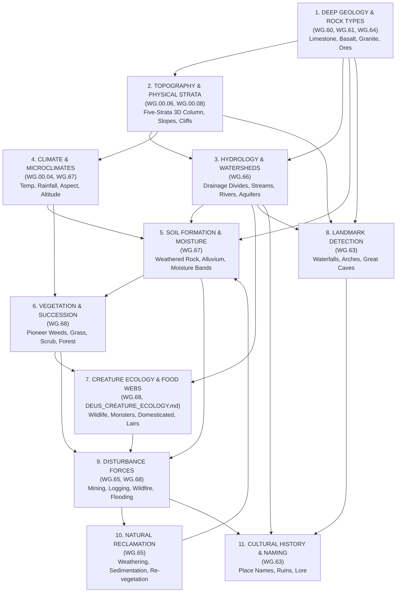

# DEUS — Natural World Systems & Emergent World Architecture
**Authoritative Architectural Specification & Visual-State Standard**  
**Document ID:** `DEUS-NAT-SYS-v1.0`  
**Integration Authority:** Gemini / Antigravity (DEUS Coordinator)  
**Approved by Owner Directive:** 2026-09-25  

---

## 1. Executive Mandate & Canonical World Design Principle

> **"DEUS does not merely generate terrain. It generates a physical natural world whose geology, water, climate, soil, vegetation, wildlife, and disturbance systems interact over time. Natural processes should be capable of producing persistent historical consequences after World Year 0."**

### Core Architectural Principles
1. **World Year 0 Starting Principle (V134):** Every standard DEUS New Game begins at World Year 0. Worldgen creates the initial viable Year-0 physical world (geology, 5 macro-Z levels, 5 physical strata, hydrology, climate, soil, vegetation, wildlife, finite minerals, and 9 faction starting camps of 8 founders = 72 colonists). History is **NOT** pre-materialized (no pre-generating centuries of abandoned mines, ancient ruins, depleted veins, or simulated civilizational detritus). All history emerges through genuine simulation.
2. **Emergent Simulation Over Scripted History:** Physical, ecological, and cultural consequences develop naturally through the interaction of simulation systems. A flooded mine, an abandoned quarry, or an overgrown settlement occurs because simulation agents and environmental forces interacted over time, not because a procedural generator planted a generic prefab.
3. **One Authoritative World & Subsystem Authority:** Worldgen and live simulation operate on one authoritative physical world and the canonical authorities of its subsystems. No separate generated-world and simulation-world representations may compete. Five-strata geometry (`DEUS_Levels.js`) remains authoritative for solid physical terrain. Fluid volume remains governed by the canonical fluid representation (`DEUS_Fluid.js`) reconciled against strata capacity and passage rules. World spatial registry (`DEUS_World.js`) coordinates entity presence.
4. **Catalogue-First Art Integration:** Any natural-world system that can produce a distinct visible state must have those states formally identified in the **Master Semantic Asset Catalogue** (`WG.20`) before production image generation begins. No ad-hoc artwork may be generated for these systems.
5. **Multi-Timescale Performance Architecture:** Natural processes operate at appropriate physical timescales (seconds, days, seasons, years, decades). Stable, undisturbed wilderness consumes 0 ms CPU recurring work. All systems comply strictly with [`docs/PERFORMANCE_ARCHITECTURE.md`](file:///c:/Users/snewt/OneDrive/Desktop/UF/docs/PERFORMANCE_ARCHITECTURE.md).

---

## 2. High-Value Natural World Systems (Systems A through O)

The fifteen high-value emergent natural-world systems are formally classified into cohesive architectural branches:

```text
┌─────────────────────────────────────────────────────────────────────────────┐
│                           DEUS NATURAL WORLD SYSTEMS                        │
├───────────────────────┬─────────────────────────────┬───────────────────────┤
│   HYDROLOGY & WATER   │     GEOLOGY & GEOMORPHOLOGY │   ECOLOGY & CLIMATE   │
│   (WBS WG.66)         │     (WBS WG.64 & WG.65)     │   (WBS WG.67 & WG.68) │
├───────────────────────┼─────────────────────────────┼───────────────────────┤
│ A. Groundwater /      │ I. Erosion, Sediment &      │ C. Soil, Fertility &  │
│    Aquifers           │    Landslides (WG.65)       │    Moisture (WG.67)   │
│ B. Drainage &         │ J. Geology-Driven Caves,    │ D. Ecological         │
│    Watersheds         │    Karst & Ore Clues (WG.64)│    Succession (WG.68) │
│ H. Seasonal Water &   │ K. Geothermal & Volcanic    │ E. Wildfire (WG.68)   │
│    Snowpack           │    Systems (WG.64)          │ F. Wildlife Territory │
│                       │ O. Long-Term Natural        │    & Food-Web (WG.68) │
│                       │    Reclamation (WG.65)      │ G. Microclimates      │
│                       │                             │    (WG.67)            │
├───────────────────────┴─────────────────────────────┴───────────────────────┤
│                   LANDMARKS, CULTURAL MEANING & HISTORY                     │
│                   (WBS WG.63)                                               │
├─────────────────────────────────────────────────────────────────────────────┤
│ L. Natural Landmark Detection (Algorithmic composition from world state)    │
│ M. Persistent Natural Disasters (Rare, permanent physical consequences)     │
│ N. Cultural Place Naming (Faction historic naming of physical features)     │
└─────────────────────────────────────────────────────────────────────────────┘
```

### Detailed System Specifications

#### A. Groundwater / Aquifers (WBS `WG.66.01–03`)
- **Plain Meaning:** Water stored and moving within the subterranean strata and rock pore spaces.
- **Physical Capabilities:** Water tables, subterranean aquifers, pressure heads, natural hillside springs, rock face seeps, hand-dug wells, mine flooding upon breach, underground cave lakes, subterranean rivers, aquifer depletion via over-pumping, and drought-induced table drop.
- **Strata & Fluid Integration:** Integrates directly with canonical physical strata (`DEUS_Levels.js`) and fluid volume simulation (`DEUS_Fluid.js`). Water does not exist as an abstract number; it occupies physical 1-ft strata cells.
- **Visible States:** Natural spring pool, weeping wet rock face, cave pool, subterranean stream bank, dry well bottom.

#### B. Drainage / Watersheds (WBS `WG.66.04–06`)
- **Plain Meaning:** Large-scale gravity flow of surface water shaped by macro-topography.
- **Physical Capabilities:** Topographical drainage divides (ridgelines), runoff direction vectors, headwater stream origins, confluence tributaries, mainstem rivers, natural catchment lakes, valley floodplains, sediment-rich deltas, and seasonal channel shifts.
- **Generation Rule:** Watershed relationships are derived from the true five-strata elevation topography rather than randomly stamped river textures. Land drains down physical gradients.
- **Visible States:** Stream source spring, gravel stream bank, deep river channel, muddy floodplain margin, delta sandbar, seasonal low-water gravel bed, overflowing flood shore.

#### C. Soil / Fertility / Moisture (WBS `WG.67.01–03`)
- **Plain Meaning:** The weathered upper loose layer of Earth supporting plant life, varying in composition, water content, and agricultural viability.
- **Physical Capabilities:** Soil formation derived from underlying geology (limestone, basalt, granite), deposited alluvial sediment, water table proximity, terrain slope, organic vegetative decay, and historical disturbance.
- **Avoidance of Tile Explosion:** Soil fertility is a continuous simulation value (0..100) but maps visually to **4 discrete moisture/fertility bands**: `DRY`, `NORMAL`, `WET`, `SATURATED`.
- **Visible States:** Dry dusty earth, rich moist loam, saturated sticky mud, river silt/alluvial deposit, rocky thin hill soil, pale exposed subsoil.

#### D. Ecological Succession (WBS `WG.68.01–03`)
- **Plain Meaning:** The predictable, multi-stage recovery and progression of plant communities following ground disturbance.
- **Physical Sequence:**
  $$\text{BARE / SCARRED} \longrightarrow \text{PIONEER WEEDS} \longrightarrow \text{GRASSES} \longrightarrow \text{SCRUB / BUSH} \longrightarrow \text{YOUNG WOODLAND} \longrightarrow \text{MATURE CLIMAX}$$
- **Triggers & Interactions:** Logging, wildfire, overgrazing, settlement abandonment, mine tailings, volcanic fallout, and climate shifts.
- **Visible States:** Scarred raw earth, patchy pioneer weeds/moss, dense pioneer grassland, thorny scrubland, sapling woodland, mature forest floor.

#### E. Wildfire (WBS `WG.68.04–06`)
- **Plain Meaning:** Naturally ignited and wind-driven combustion of vegetation and combustible structures.
- **Physical Capabilities:** Ignition from lightning strikes during dry storms, volcanic sparks/lava contact, campfire negligence, or deliberate arson. Fire spreads based on fuel moisture, fuel density, wind vector, and slope.
- **Performance Rule:** Event-driven and spatially bounded. Uses active burning front queues; dormant trees never scan per frame.
- **Visible States:** Scorched black earth, smoldering ground ash, charred standing tree skeleton, fallen burnt log, active flame loop (VFX), smoke plume (VFX), pioneer fireweed regrowth.

#### F. Wildlife Territory, Migration & Food-Web Pressure (WBS `WG.68.07–08`)
- **Plain Meaning:** Animal populations inhabiting natural habitats, foraging, reproducing, and moving in response to resources, seasons, and predation.
- **Physical Model:** Simplified, robust ecological chain:
  $$\text{VEGETATION / WATER} \longrightarrow \text{HERBIVORES (Grazers/Browsers)} \longrightarrow \text{PREDATORS (Carnivores/Pack Hunters)}$$
- **Behaviors:** Territorial roaming, waterhole convergence, seasonal altitude migration (summer high meadows $\rightarrow$ winter valley bottoms), fleeing wildfires, avoiding human settlements, and population crashes under overhunting.
- **Visual Representation:** Handled through living creature charsets and territorial marking props (scat, worn animal trails, trampled water margins), not static terrain.

#### G. Microclimates (WBS `WG.67.04–06`)
- **Plain Meaning:** Localized climatic zones differing from the broader regional biome due to terrain features.
- **Causal Factors:**
  - *Elevation:* Temperature lapse rate (-1°C per 15 strata elevation).
  - *Slope Aspect:* South-facing slopes receive higher solar warmth; north-facing slopes stay cool and moist.
  - *Cold Air Pooling:* Frost pockets forming in sheltered valleys at night.
  - *Rain Shadows:* Dry leeward slopes behind mountain ridges.
  - *Geothermal Warming:* Thawed ground and lush flora near hot springs within sub-freezing biomes.
- **Visible States:** Frost-dusted depression, lush geothermal hollow, sun-parched hillside grass, sheltered mossy cliff base.

#### H. Seasonal Water & Snowpack (WBS `WG.66.07–08`)
- **Plain Meaning:** The accumulation, freezing, and thawing of atmospheric precipitation across seasonal cycles.
- **Physical Capabilities:** High-altitude winter snow accumulation, snowpack depth tracking (1..5 strata in severe alpine zones), spring thaw runoff pulses that swell streams and flood valley floodplains, seasonal wetland drying, and water surface freezing.
- **Performance Rule:** Avoids simulating individual raindrops or snowflakes. Operates as regional daily/seasonal accumulators.
- **Visible States:** Dusting of light snow, deep snowpack (1-ft to 3-ft strata), melting slush/snow margins, frozen water surface, thaw mud.

#### I. Erosion, Sediment & Landslides (WBS `WG.65.03–06`)
- **Plain Meaning:** The physical detachment, downhill movement, and deposition of rock, gravel, and soil by gravity and water.
- **Physical Capabilities:** Hydraulic bank erosion along rivers, steep slope failure (landslides during heavy rain), quarry wall slumping, talus/scree accumulation at cliff feet, sediment deposition in lakes and deltas.
- **Matter Conservation:** Operates under the strict Matter Conservation Invariant (`INV-SIM-01`): every stratum of eroded soil or rock must be redeposited as loose sediment, gravel, or alluvial fill.
- **Visible States:** Eroded cliff scar, talus scree apron, landslide debris lobe, silty mud deposit, washed-out riverbank.

#### J. Geology-Driven Caves, Karst & Ore Clues (WBS `WG.64.01–03`)
- **Plain Meaning:** Subterranean voids and surface geological features directly shaped by rock type and tectonic fracturing.
- **Physical Capabilities:** Karst dissolution in limestone/dolomite creating sinkholes, disappearing streams, and decorated caverns; structural fault fractures forming deep vertical chasms; mineral staining on surface cliffs hinting at subterranean veins; indicator flora growing over specific metalliferous deposits.
- **Gameplay Intent:** Enables players to read surface clues to deduce underground resources and hazards without UI cheating.
- **Visible States:** Limestone sinkhole depression, copper-stained green rock face, iron-stained rust seepage, fracture fissure, limestone stalactite cave mouth.

#### K. Geothermal & Volcanic Systems (WBS `WG.64.04–06`)
- **Plain Meaning:** Subsurface magma, heat, steam, and volcanic fluids escaping into upper strata and the surface.
- **Physical Capabilities:** Mineral-rich hot springs, pressurized steam vents, sulfur fumaroles, heated subterranean caverns, basalt lava tubes, active magma pools, and volcanic ash deposits.
- **Visible States:** Steaming hot spring pool, active steam vent (VFX), yellow sulfur mineral crust, porous volcanic basalt, simmering lava shore, volcanic ash bed.

#### L. Natural Landmark Detection (WBS `WG.63.01–02`)
- **Plain Meaning:** Algorithmic recognition of exceptionally rare, dramatic, or significant natural geological and hydrological formations.
- **Compositional Principle:** Landmarks are **not** monolithic pre-drawn sprites stamped onto the map. They are **detected compositions** derived from natural worldgen:
  - *Monumental Waterfall:* Continuous high-volume river plunging $\ge 15$ strata over a sheer cliff.
  - *Great Arch / Natural Bridge:* Carved stone strut spanning a natural cut with sky open above and below.
  - *Abyssal Chasm:* Deep tectonic rift penetrating from Z0 down to Z-2 bedrock.
  - *Great Cavern Dome:* Vast roofed chamber spanning $\ge 25 \times 25$ cells with $\ge 8$ ft clearance.
  - *Ancient Grove:* Cluster of maximum-age, unlogged ancient trees in an undisturbed basin.
  - *Geothermal Caldera:* High-density cluster of boiling springs and fumaroles.
- **Durable Identity:** Detected landmarks receive persistent identifiers (`Landmark #1042: The Roaring Leap`) referenced in world history, maps, and cultural lore.

#### M. Persistent Natural Disasters (WBS `WG.63.03–04`)
- **Plain Meaning:** Rare, high-magnitude environmental catastrophes that leave permanent physical and cultural scars on the landscape.
- **Events:** 100-year river floods (carving new river channels and wiping low-lying farms), devastating wildfires (creating decades-long burn scars), volcanic ruptures (blanketing regions in ash and basalt), major earthquakes (opening ground fissures and collapsing unstable mine shafts), severe multi-year droughts.
- **Rule:** Used sparingly during historical simulation; never used to wipe player settlements arbitrarily without telegraphing.

#### N. Cultural Place Naming (WBS `WG.63.05–06`)
- **Plain Meaning:** Factions, cultures, and colonists assigning linguistically coherent names to real, existing physical features.
- **Decoupled Architecture:** The physical entity (e.g. `River #83`, `Mountain #12`, `Forest #04`) exists independently as an authoritative geographical object. Factions generate subjective names based on cultural language, historical events, founder names, or physical traits (e.g., Human: *"Silverwash"*, Dwarf: *"Gabil-Aman"*, Elf: *"Celeb-Duin"*).
- **Historic Evolution:** A river where a famous battle occurred may be renamed *"The Red Run"* in regional human culture, while neighboring elves retain their ancient name.

#### O. Long-Term Natural Reclamation (WBS `WG.65.01–18`)
- **Plain Meaning:** The complete physical cycle from pristine nature through human exploitation, abandonment, decay, sediment accumulation, re-vegetation, and landscape stabilization.
- **Canonical Cycle:**
  $$\text{NATURAL ROCK} \xrightarrow{\text{mining}} \text{BLOCKS/WALLS} \xrightarrow{\text{decay}} \text{RUBBLE} \xrightarrow{\text{weathering}} \text{SEDIMENT/FILL} \xrightarrow{\text{succession}} \text{SOIL} \xrightarrow{\text{revegetation}} \text{NATURALIZED LANDSCAPE}$$
- **Anti-Respawn Guarantee:** Mining does not magically respawn blocks. Naturalization produces a **new, stable physical landscape** containing buried archaeological stratigraphy.

---

## 3. System Dependency Graph

The natural world systems form a strict causal hierarchy where lower foundational substrates shape higher emergent layers:



---

## 4. WorldGen vs. Live Simulation Ownership

To guarantee **Lean Architecture**, zero data duplication, and perfect save-state fidelity, Project DEUS enforces strict single-ownership boundaries across world time:

| Domain | WorldGen Ownership (World Year 0) | Live Simulation Ownership (Post-Year 0) |
|---|---|---|
| **Geology & Ores** | Generates rock stratigraphy, faults, finite veins, and initial karst cavities. | Tracks mineral extraction, tool wear, quarrying, and vein exhaustion. Rock does not regenerate. |
| **Hydrology** | Solves macro-drainage networks, river courses, valley lakes, and static water tables. | Simulates seasonal runoff pulses, drought drying, well drawdown, flooding, and water table fluctuation. |
| **Soil & Moisture**| Computes initial soil depth, texture, and baseline moisture bands from geology/hydrology. | Updates localized soil compaction, agricultural depletion, mud churn, and alluvial silt deposits. |
| **Vegetation** | Distributes climax biome flora, groves, ancient trees, and natural forest clearings. | Executes growth cycles, seed dispersal, logging, agricultural clearing, fire destruction, and succession. |
| **Wildfire** | Zero active fires at Year 0. Plants initial combustible fuel load map. | Evaluates lightning strikes, fire spread queues, fuel consumption, smoke emission, and burn scars. |
| **Wildlife** | Places viable initial breeding pairs, dens, and herds in suitable biomes/habitats. | Ticks hunger, reproduction, seasonal migration, predator-prey chases, hunting mortality. |
| **Snow & Ice** | Establishes Year-0 seasonal baseline snowpack on high-altitude peaks. | Accumulates winter snow strata, computes spring thaw runoff, freezes and thaws water bodies. |
| **Geomorphology** | Carves initial natural cuts, chasms, talus slopes, and riverbeds. | Simulates hydraulic bank collapse, slope creep, quarry stabilization, and sediment deposit over decades. |
| **Landmarks** | Runs algorithmic detector across Year-0 terrain; assigns immutable Landmark IDs. | Records historical landmark visits, battles fought at landmarks, and landmark discovery by factions. |
| **Place Names** | Generates primordial topographic descriptors (e.g. *"Great Northern Ridge"*). | Factions assign cultural place names upon founding settlements, exploring, or fighting battles. |

---

## 5. Multi-Timescale Performance Architecture

Compliance with [`docs/PERFORMANCE_ARCHITECTURE.md`](file:///c:/Users/snewt/OneDrive/Desktop/UF/docs/PERFORMANCE_ARCHITECTURE.md) requires that the vast living world never consumes recurring CPU time when in a steady state. Natural processes are categorized into five discrete execution cadences:

```text
TIMESCALE              TYPICAL PROCESSES                           PERFORMANCE STRATEGY
─────────────────────────────────────────────────────────────────────────────────────────────
1. PER-FRAME (16.6ms)  Visible water ripple/flame/steam animation  Offscreen culled; static
                       Viewport terrain & entity rendering         geometry ticked via frame3;
                                                                   Zero allocation hot-paths.
─────────────────────────────────────────────────────────────────────────────────────────────
2. MINUTE-SCALE        Active wildfire front propagation           Active-Front queue ONLY.
   (Action Domain)     Flash flood water expansion                 Dormant cells incur 0 ms.
                       Active landslide / slope failure            Dirty bounding box tracking.
─────────────────────────────────────────────────────────────────────────────────────────────
3. DAILY-SCALE         Soil moisture evaporation / rain soaking    Staggered chunk scheduler;
   (Simulation Domain) Wildlife daily grazing & waterhole visits   Interleaved tick (64 chunks
                       Snow accumulation & melt depth              per frame over 60 seconds).
─────────────────────────────────────────────────────────────────────────────────────────────
4. SEASONAL-SCALE      Vegetation growth & crop ripening           Quarterly macro-tick;
   (Historical Domain) Wildlife seasonal herd migration           Coarse spatial summaries;
                       Regional river high/low water shifts        Cached biome modifiers.
─────────────────────────────────────────────────────────────────────────────────────────────
5. DECADAL / CENTURY   Ecological succession progression           Long-time deterministic
   (Historical Domain) Geomorphic weathering & sediment deposit   catch-up equations upon
                       Ruins decay & naturalization                area activation. No per-
                       Mine/quarry stabilization                   frame historical ticks.
```

---

## 6. Semantic Visual-State Classification Standard

To prevent runaway asset inflation, every world state produced by a natural system must be assigned to exactly one of six canonical visual categories before any asset creation:

| Category | Definition | Asset Production Implication |
|---|---|---|
| `SIMULATION_ONLY` | Pure numeric/logical state required by the engine (e.g., exact soil pH `6.4`, groundwater table depth `14.2 ft`, animal calories `840`). | **ZERO art assets.** Exists only in data memory. |
| `VISUAL_REQUIRED` | A distinct physical landscape condition that the player must see directly on the tile grid (e.g., dry earth vs. muddy soil, green leaf vs. scorched ground). | **Mandatory semantic catalogue entry** and dedicated atlas slot. |
| `VISUAL_OPTIONAL` | Subtle aesthetic variety that enhances visual richness but is not critical to gameplay (e.g., 4th rock patina variant, minor flower tint). | Low priority; deferred to polish packs or produced as compositional overlays. |
| `VFX_REQUIRED` | Dynamic, non-tile environmental motion or atmospheric effect (e.g., rising steam wisps, chimney smoke, active flame flicker, falling ash). | Handled via animated sprite sheets or particle hooks (`WG.11`). |
| `AUDIO_REQUIRED` | Acoustic landscape cues (e.g., babbling brook, rushing waterfall, roaring wildfire, whistling mountain wind, hot spring bubbling). | Forwarded to Sound/Audio WBS roadmap. |
| `UI_ONLY` | Information displayed only when inspected via `UF_Look` (cursor tooltip) or `UF_Sheet` (e.g., exact agricultural fertility rating, regional watershed name). | Handled via text inspection strings. |

---

## 7. Initial Visual-State Families to Reserve

The following visual-state families are formally reserved for inclusion in the Master Semantic Asset Catalogue (`WG.20`):

```text
FAMILY ID                 SEMANTIC MEMBERS / VISUAL STATES                          CATEGORY
───────────────────────────────────────────────────────────────────────────────────────────────
FAM_WATER_GROUND          spring_pool, rock_seep, cave_pool, underground_stream     VISUAL_REQUIRED
FAM_DRAINAGE_EDGE         stream_source, stream_bank, river_bank, floodplain_mud,   VISUAL_REQUIRED
                          delta_sandbar, low_water_gravel, flood_overflow
FAM_SOIL_MOISTURE         soil_dry, soil_normal, soil_moist, soil_saturated_mud     VISUAL_REQUIRED
FAM_SOIL_HORIZON          soil_alluvial_rich, soil_rocky_thin, soil_pale_subsoil    VISUAL_REQUIRED
FAM_SUCCESSION_STAGE      scar_bare, weed_pioneer, grass_recovery, scrub_dense,     VISUAL_REQUIRED
                          woodland_young, forest_mature
FAM_FIRE_TERRAIN          ground_scorched, ground_ash_soot, tree_charred_trunk,     VISUAL_REQUIRED
                          log_burnt_hollow
FAM_FIRE_VFX              vfx_flame_loop, vfx_smoke_plume, vfx_embers_ambient       VFX_REQUIRED
FAM_SNOW_ACCUMULATION     snow_dusting, snow_deep_stratum, snow_slush_thaw,         VISUAL_REQUIRED
                          water_frozen_ice
FAM_GEOMORPHIC_DEPOSIT    rubble_loose, gravel_scree, talus_apron, mud_deposit,     VISUAL_REQUIRED
                          quarry_scar_weathered, tailings_overgrown
FAM_GEOLOGICAL_EXPOSURE   ore_vein_exposed, rock_stained_copper, rock_stained_iron, VISUAL_REQUIRED
                          rock_fracture_fissure, karst_sinkhole_rim
FAM_GEOTHERMAL_SURFACE    spring_hot_steaming, crust_mineral_sulfur, basalt_porous, VISUAL_REQUIRED
                          lava_shore_crusted, ash_volcanic_bed
FAM_GEOTHERMAL_VFX        vfx_steam_vent_fumarole, vfx_lava_bubble                  VFX_REQUIRED
FAM_HISTORICAL_RUIN       road_abandoned_cracked, road_overgrown, wall_collapsed,   VISUAL_REQUIRED
                          foundation_buried, rubble_mossy
```

---

## 8. Anti-Explosion Strategy: Composition Over Unique Assets

To keep total shipped atlas memory within strict target budgets (`< 350 MB RAM`), DEUS enforces **Composition Over Unique Assets**:

```text
                      COMPOSITIONAL TILE ASSEMBLY
┌─────────────────────────────────────────────────────────────────────────┐
│ [Layer 3: Environmental Scatter / Overgrowth]   (Pioneer weeds / Moss)  │
├─────────────────────────────────────────────────────────────────────────┤
│ [Layer 2: Surface State / Moisture Overlay]      (Wet sheen / Mud / Ash)│
├─────────────────────────────────────────────────────────────────────────┤
│ [Layer 1: Base Substrate / Autotile]            (Limestone / Loam Soil) │
└─────────────────────────────────────────────────────────────────────────┘
```
1. **Never Multiply Continuous Variables:** Never generate `fertility_1.png` through `fertility_100.png`. Group into 4 semantic moisture bands (`DRY`, `NORMAL`, `WET`, `SATURATED`).
2. **Reusable Material Ramps:** A single wetness overlay tile can provide the visual state for wet limestone, wet granite, wet basalt, and wet loam.
3. **Reusable Snow & Ash Layers:** A semi-transparent snow accumulation mask applies across grass, dirt, stone, and roofs without generating unique frozen variants of every object.
4. **Natural Landmarks as Compositions:** A grand waterfall is generated by composing cliff autotiles, high-volume river flow, drop edge autotiles, and mist VFX. Zero unique "giant waterfall" sprites are required.

---

## 9. Volumetric Fluid Depth Standard (Water & Lava)

In strict accordance with the canonical five physical strata foundation (`DEUS_Levels.js`, `VISION.md` V135), Water and Lava each possess **five distinct semantic depth visual expressions**:

```text
STRATUM DEPTH    WATER EXPRESSION                         LAVA EXPRESSION
───────────────────────────────────────────────────────────────────────────────────────────────
Depth 1 (1 ft)   Shallow Shallows: Crystal transparent,   Cooling Skin: Dark crusted basalt
                 bed fully visible, light sparkle.        plates with thin orange incandescent veins.
───────────────────────────────────────────────────────────────────────────────────────────────
Depth 2 (2 ft)   Wading Shallows: Clear tint, bottom      Sluggish Flow: Semi-crusted molten magma,
                 features visible, soft refraction.       slow viscous shearing, medium orange glow.
───────────────────────────────────────────────────────────────────────────────────────────────
Depth 3 (3 ft)   Mid Depth: Saturated body color,         Active Magma: Bright radiant orange-red,
                 deep bed shadowed, surface ripples.      frequent convection bubbling, strong glow.
───────────────────────────────────────────────────────────────────────────────────────────────
Depth 4 (4 ft)   Submerged: Deep oceanic/river blue,      Deep Molten: White-hot luminous core,
                 bed invisible, heavy refraction.         rapid fluid convection, intense illumination.
───────────────────────────────────────────────────────────────────────────────────────────────
Depth 5 (5 ft)   Abyssal Column: Opaque deep fluid body,  Volcanic Torrent: Blinding incandescent
(Full Cell)      full 5-ft water column, heavy swells.    liquid magma, complete stratum fill.
```

---

## 10. Catalogue Completeness Gate & Traceability Flow

Before large-scale production art generation commences for any biome or natural system, the pipeline must enforce 100% end-to-end traceability:

```text
WORLD SYSTEM (e.g. Groundwater WG.66)
       ↓
WORLD STATE (e.g. STATE_SPRING_ACTIVE)
       ↓
VISIBLE STATE CLASSIFICATION (VISUAL_REQUIRED)
       ↓
SEMANTIC ASSET CATALOGUE ENTRY (FAM_WATER_GROUND.spring_pool)
       ↓
METADATA SPECIFICATION (48x48 px, 3-frame loop, Palette Ramp: Water)
       ↓
PERMANENT ATLAS SLOT RESERVATION (Sheet A1, Cell X=14, Y=8)
       ↓
READY FOR GENERATION (Nano Banana Pro prompt authorized)
```

### The Completeness Checklist
- [ ] Every state produced by the system is classified (`SIMULATION_ONLY`, `VISUAL_REQUIRED`, `VISUAL_OPTIONAL`, `VFX_REQUIRED`, `AUDIO_REQUIRED`, `UI_ONLY`).
- [ ] All `VISUAL_REQUIRED` states have assigned semantic IDs, dimensions, variant counts, and animation frame specs.
- [ ] Every asset entry is mapped to an authoritative biome/Z applicability filter.
- [ ] Permanent atlas slots are allocated on un-padded standard sheets (`WG.30`).
- [ ] Zero orphan states (world states with no art) and zero phantom assets (art with no consuming simulation state).
- [ ] Explicit Owner approval received via standard YEA/NAY review.
